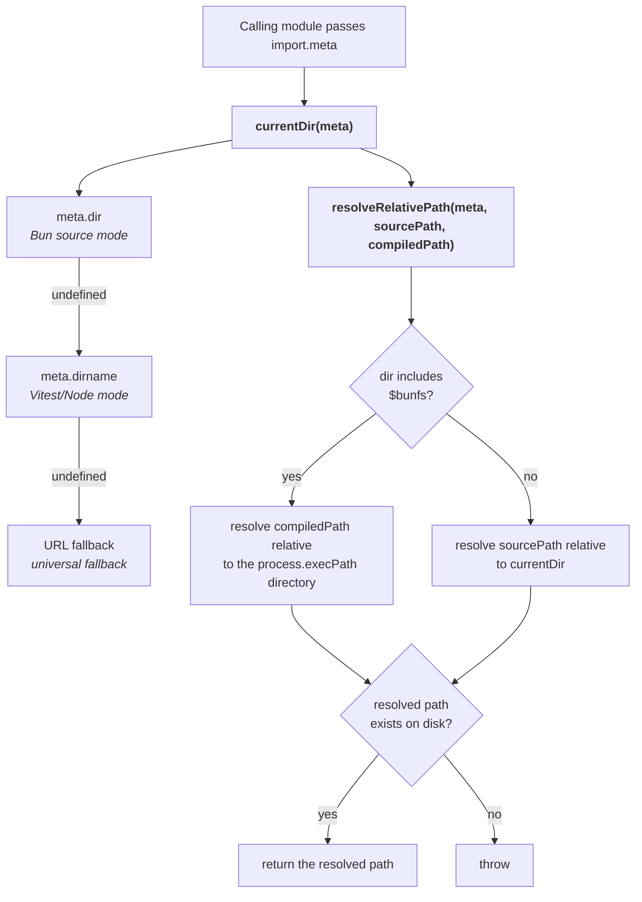

# @testdouble/bun-helpers

> **Tier 5 · Contributor reference.** Internal documentation for the `packages/bun-helpers` package; there is no user-facing equivalent. If you arrived here as a user, start at the [Skillwalker README](../README.md).

Change this package when you need cross-runtime path resolution — locating a sibling file (script, config, template) that must resolve correctly under the Bun runtime, the Vitest/Node test runner, and Bun compiled binaries alike. It encapsulates the `import.meta.dir` / `import.meta.dirname` / `import.meta.url` fallback chain so consumers don't reimplement it.

- **Last Updated:** 2026-05-15
- **Authors:**
  - River Bailey (river.bailey@testdouble.com)

## Overview

- Tiny shared workspace package (`packages/bun-helpers/`) with zero workspace dependencies
- Encapsulates the `import.meta.dir` / `import.meta.dirname` / `import.meta.url` fallback chain into reusable helpers
- Handles compiled binary path resolution where `import.meta.dir` resolves to a virtual `/$bunfs/root` path
- Consumed by `@testdouble/test-fixtures`, `@testdouble/claude-integration`, and any package needing cross-runtime file path resolution

Key files:
- `packages/bun-helpers/index.ts` - Public exports (re-exports from `src/resolve.js`)
- `packages/bun-helpers/src/resolve.ts` - Core implementation of `currentDir` and `resolveRelativePath`
- `packages/bun-helpers/src/resolve.test.ts` - Unit tests covering all runtime contexts
- `packages/bun-helpers/package.json` - Package metadata (`@testdouble/bun-helpers`, v0.1.0)

## Architecture



## Key Files

| File | Purpose |
|------|---------|
| `packages/bun-helpers/index.ts` | Barrel export re-exporting `currentDir` and `resolveRelativePath` from `src/resolve.js` |
| `packages/bun-helpers/src/resolve.ts` | Implementation of both exported functions |
| `packages/bun-helpers/src/resolve.test.ts` | Vitest unit tests for all fallback paths and error cases |
| `packages/bun-helpers/package.json` | Package definition (private, ESNext module, bun-types dev dependency) |
| `packages/bun-helpers/tsconfig.json` | TypeScript config (ESNext target, bundler module resolution, strict mode) |

## Core Types

```typescript
// currentDir accepts an ImportMeta object and returns the directory path as a string.
// The caller must pass import.meta directly because it is scoped to the calling module.
function currentDir(meta: ImportMeta): string

// resolveRelativePath accepts import.meta, a source-mode relative path, and a
// compiled-binary relative path. Returns the resolved absolute path or throws
// if the path does not exist on disk.
function resolveRelativePath(meta: ImportMeta, sourcePath: string, compiledPath: string): string
```

## Implementation Details

### currentDir -- Directory Resolution Fallback Chain

The `currentDir` function resolves the current file's directory across three runtime contexts using a nullish-coalescing fallback chain:

```typescript
export function currentDir(meta: ImportMeta): string {
  return (meta as any).dir           // Bun source mode
    ?? (meta as any).dirname         // Vitest/Node mode
    ?? path.dirname(new URL(meta.url).pathname)  // Universal URL fallback
}
```

The `as any` casts are necessary because TypeScript's `ImportMeta` type definition does not include all runtime-specific properties. Bun exposes `dir` while Node/Vitest exposes `dirname`. The URL-based fallback works in any ESM-compliant runtime.

| Runtime Context | Property Used | Example Value |
|----------------|---------------|---------------|
| Bun source | `import.meta.dir` | `/Users/dev/tests/packages/bun-helpers/src` |
| Vitest/Node | `import.meta.dirname` | `/Users/dev/tests/packages/bun-helpers/src` |
| Any ESM runtime | `import.meta.url` | `file:///Users/dev/tests/packages/bun-helpers/src/resolve.ts` (dirname extracted) |
| Bun compiled binary | `import.meta.dir` | `/$bunfs/root` (virtual, non-functional for relative paths) |

### resolveRelativePath -- Compiled Binary Awareness

The `resolveRelativePath` function selects between two path resolution strategies based on whether the code is running inside a Bun compiled binary:

```typescript
export function resolveRelativePath(meta: ImportMeta, sourcePath: string, compiledPath: string): string {
  const dir = currentDir(meta)

  const resolved = dir.includes('$bunfs')
    ? path.resolve(path.dirname(process.execPath), compiledPath)
    : path.resolve(dir, sourcePath)

  if (!fs.existsSync(resolved)) {
    throw new Error(
      `Resolved path does not exist: ${resolved} (compiled: ${dir.includes('$bunfs')}, dir: ${dir})`
    )
  }

  return resolved
}
```

**Detection mechanism:** When Bun compiles a binary with `bun build --compile`, all bundled modules report `import.meta.dir` as `/$bunfs/root`. The function detects this by checking if the directory string includes `$bunfs`.

**Source mode:** Resolves `sourcePath` relative to the calling file's directory (via `currentDir`). This is the standard relative path resolution used during development and testing.

**Compiled mode:** Resolves `compiledPath` relative to the directory containing the compiled binary (`process.execPath`). `scripts/build.ts` compiles binaries into `build/` and copies each runtime asset in beside them, so `compiledPath` is just the asset's filename.

**Existence guard:** Both modes verify the resolved path exists on disk and throw with a diagnostic error message that includes the resolution mode and directory, aiding debugging when paths are misconfigured.

### Why Callers Must Pass import.meta

The `import.meta` object is scoped to the module where it appears in source code. A helper function in a different module cannot access the caller's `import.meta`. This is why both functions accept `meta: ImportMeta` as a parameter rather than accessing `import.meta` internally.

## Error Handling

| Scenario | Error | Behavior |
|----------|-------|----------|
| Resolved source path does not exist | `Error: Resolved path does not exist: {path} (compiled: false, dir: {dir})` | Throws immediately with diagnostic details |
| Resolved compiled path does not exist | `Error: Resolved path does not exist: {path} (compiled: true, dir: {dir})` | Throws immediately with diagnostic details |

## Testing

- `packages/bun-helpers/src/resolve.test.ts` - Vitest unit tests

### Test Patterns

Tests use a temporary directory (`os.tmpdir()`) created in `beforeEach` and cleaned up in `afterEach` to provide real filesystem paths for existence checks. The `makeMeta` helper constructs mock `ImportMeta` objects with selective property overrides to simulate each runtime context.

Key test scenarios for `currentDir`:
- Returns `meta.dir` when available (Bun source mode)
- Falls back to `meta.dirname` when `dir` is undefined (Vitest/Node)
- Falls back to URL parsing when both `dir` and `dirname` are undefined
- Prefers `dir` over `dirname` (priority order)
- Prefers `dirname` over URL (priority order)

Key test scenarios for `resolveRelativePath`:
- Resolves `sourcePath` relative to `currentDir` in source mode
- Resolves `compiledPath` relative to `process.execPath` directory when dir includes `$bunfs`
- Throws when resolved path does not exist in source mode
- Throws when resolved path does not exist in compiled mode

The compiled binary tests temporarily override `process.execPath` using `Object.defineProperty` and restore it in a `finally` block.

## Adding a New Consumer

1. **Add the workspace dependency** in your package's `package.json`: `"@testdouble/bun-helpers": "workspace:*"`
2. **Import the needed function** from the package:
   - Use `currentDir` when you only need the directory path and do not need compiled binary support
   - Use `resolveRelativePath` when resolving non-TypeScript sibling files (scripts, configs, templates) that must work in compiled binaries
3. **Pass `import.meta` directly** at the call site -- do not store it in a variable and pass it later from a different module

## Related References

- [Cross-Runtime Meta Property Resolution](./coding-standards/cross-runtime-meta-resolution.md) - Coding standard that defines the fallback chain pattern and recommends using this package
- [Skillwalker Architecture](./skillwalker-architecture.md) - System architecture showing bun-helpers in the dependency graph
- [ESM Import Conventions](./coding-standards/esm-import-conventions.md) - Import conventions including `.js` extensions in relative imports
- [Project Discovery](./project-discovery.md) - Workspace package layout and Bun runtime details

---

**Next:** [Skillwalker Architecture](./skillwalker-architecture.md) — where this package sits in the dependency graph and which packages consume it.
**Related:** [Claude Integration](./claude-integration.md) — a consumer that uses `resolveRelativePath` to locate `sandbox-run.sh` across runtimes.
