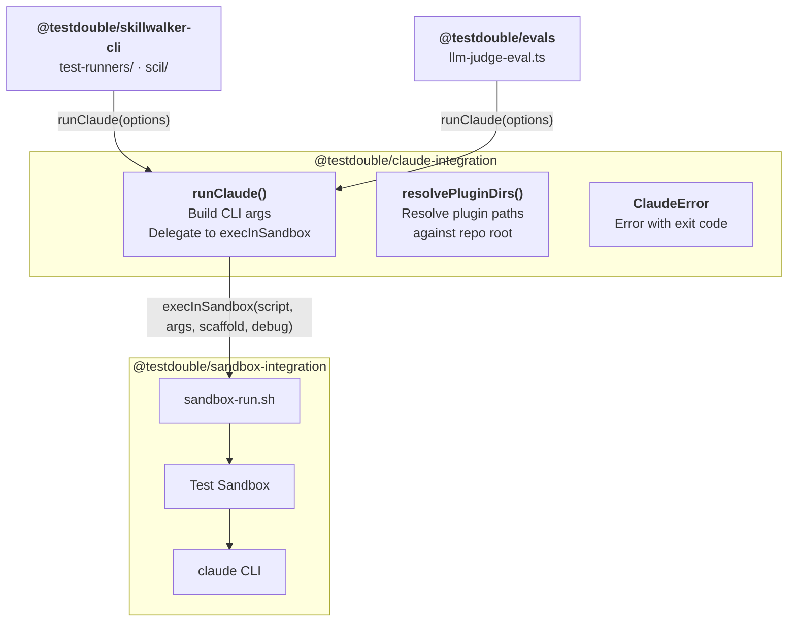

# Claude Integration

> **Tier 5 · Contributor reference.** Internal documentation for the `packages/claude-integration` package; there is no user-facing equivalent. If you arrived here as a user, start at the [Skillwalker README](../README.md).

Change this package when you need to touch how Skillwalker invokes Claude inside the Test Sandbox — the CLI flag construction, plugin-directory resolution, output-file extraction, or the sandbox shell scripts. It wraps the Claude CLI behind a programmatic TypeScript API so test runners and eval pipelines never construct CLI arguments directly.

- **Last Updated:** 2026-05-15
- **Authors:**
  - River Bailey (river.bailey@testdouble.com)

## Overview

- The `@testdouble/claude-integration` package provides the `runClaude` function, which builds the full set of Claude CLI flags and delegates execution to the `@testdouble/sandbox-integration` sandbox.
- Consumers never construct Claude CLI arguments themselves -- they pass a typed `ClaudeRunOptions` object and get back a `ClaudeRunResult` with exit code, stdout, and stderr.
- `resolvePluginDirs` converts relative plugin directory names to absolute paths anchored at a repository root, used by the CLI package when building test runner flags.
- `ClaudeError` is a custom error class carrying the process exit code for structured error handling in callers.

Key files:
- `packages/claude-integration/index.ts` - Public API barrel export
- `packages/claude-integration/src/run-claude.ts` - Core `runClaude` function that builds CLI args and calls `execInSandbox`
- `packages/claude-integration/src/extract-output-files.ts` - Extracts files written by skills/agents from the sandbox
- `packages/claude-integration/src/types.ts` - `ClaudeRunOptions` and `ClaudeRunResult` interfaces
- `packages/claude-integration/src/plugin-flags.ts` - `resolvePluginDirs` path resolution utility
- `packages/claude-integration/src/errors.ts` - `ClaudeError` custom error class

## Architecture



## Key Files

| File | Purpose |
|------|---------|
| `packages/claude-integration/index.ts` | Barrel export for `runClaude`, `extractOutputFiles`, `resolvePluginDirs`, `ClaudeError`, and type interfaces |
| `packages/claude-integration/src/run-claude.ts` | Builds Claude CLI arguments from typed options and delegates to `execInSandbox` |
| `packages/claude-integration/src/types.ts` | Defines `ClaudeRunOptions` (input) and `ClaudeRunResult` (output) interfaces |
| `packages/claude-integration/src/plugin-flags.ts` | Resolves relative plugin directory names to absolute paths using `path.join` |
| `packages/claude-integration/src/extract-output-files.ts` | Extracts output files written by skills/agents from the sandbox via `sandbox-extract.sh` |
| `packages/claude-integration/src/errors.ts` | Custom `ClaudeError` class extending `Error` with an `exitCode` property |
| `packages/claude-integration/sandbox-run.sh` | Shell script executed inside the Test Sandbox to set up a scaffold git repo and invoke `claude` |
| `packages/claude-integration/sandbox-extract.sh` | Shell script that finds and extracts files written by skills/agents inside the sandbox, outputting JSON lines |

## Core Types

```typescript
// packages/claude-integration/src/types.ts

export interface ClaudeRunOptions {
  model: string          // Claude model name (e.g., 'sonnet', 'opus')
  prompt: string         // The prompt text passed via --print
  pluginDirs?: string[]  // Absolute paths to plugin directories (converted to --plugin-dir flags)
  scaffold?: string | null  // Path to a scaffold directory copied into the sandbox working dir
  debug?: boolean        // Enables debug output in sandbox execution
}

export interface ClaudeRunResult {
  exitCode: number  // Process exit code from Claude CLI
  stdout: string    // Standard output captured from the process
  stderr: string    // Standard error captured from the process
}
```

### Output File Extraction

```typescript
// packages/claude-integration/src/extract-output-files.ts

export interface OutputFile {
  path: string     // Relative path of the file inside the sandbox
  content: string  // Full text content of the file
}

export async function extractOutputFiles(debug: boolean): Promise<OutputFile[]>
```

`extractOutputFiles` runs `sandbox-extract.sh` inside the Test Sandbox to find and capture files that were written by the skill or agent during execution. The script outputs JSON lines (`{ path, content }`) to stdout, which are parsed into `OutputFile` objects. Returns an empty array when no files were written or the script produces no output.

## Implementation Details

### CLI Argument Construction

The `runClaude` function translates a `ClaudeRunOptions` object into the full set of Claude CLI flags. Every invocation includes these hardcoded flags:

| Flag | Value | Purpose |
|------|-------|---------|
| `--no-session-persistence` | (none) | Prevents session state from persisting between runs |
| `--output-format` | `stream-json` | Structured JSON output for programmatic parsing |
| `--verbose` | (none) | Enables verbose logging |
| `--dangerously-skip-permissions` | (none) | Skips permission prompts for automated test execution |
| `--model` | from `options.model` | Selects the Claude model |
| `--print` | from `options.prompt` | Passes the prompt as a one-shot print command |

Plugin directories are converted to repeated `--plugin-dir` flag pairs using `flatMap`:

```typescript
// packages/claude-integration/src/run-claude.ts
const pluginFlags = pluginDirs.flatMap(dir => ['--plugin-dir', dir])
```

The `--print` flag is always placed last in the argument array, after all other flags including plugin directories.

### Sandbox Script Resolution

The `sandbox-run.sh` script path is resolved at module load time using `resolveRelativePath` from `@testdouble/bun-helpers`. This utility handles cross-runtime path resolution across Bun, Vitest, and the compiled binaries. In a compiled binary the script is read from beside the executable, where `scripts/build.ts` copies it:

```typescript
// packages/claude-integration/src/run-claude.ts
const sandboxRunScript = resolveRelativePath(
  import.meta,
  '../sandbox-run.sh',
  'sandbox-run.sh',
)
```

### Sandbox Script Behavior

The `sandbox-run.sh` script runs inside the Test Sandbox and performs two tasks:

1. **Scaffold setup** (optional) -- If a scaffold path is provided and exists as a directory, the script copies its contents into a temporary directory, initializes a git repository with an initial commit, and changes into that directory. This gives Claude a realistic working tree.
2. **Claude execution** -- Runs `claude` with all remaining arguments via `exec`, replacing the shell process.

### Plugin Directory Resolution

`resolvePluginDirs` converts relative plugin names to absolute paths by joining them with a provided repository root:

```typescript
// packages/claude-integration/src/plugin-flags.ts
export function resolvePluginDirs(plugins: string[], repoRoot: string): string[] {
  return plugins.map(p => path.join(repoRoot, p))
}
```

This is consumed by the CLI package's `step-6-build-flags` to convert plugin names from test configuration into absolute paths suitable for the `--plugin-dir` flag.

### Error Handling

`ClaudeError` extends `Error` with an `exitCode` property that can be a number or `null` (for cases where the process exit code is unknown):

```typescript
// packages/claude-integration/src/errors.ts
export class ClaudeError extends Error {
  constructor(message: string, public exitCode: number | null) {
    super(message)
    this.name = 'ClaudeError'
  }
}
```

## Configuration

| Variable | Description | Default |
|----------|-------------|---------|
| `model` | Claude model identifier passed to `--model` flag | (required, no default) |
| `scaffold` | Path to scaffold directory for workspace setup | `null` (no scaffold) |
| `debug` | Enable debug output in sandbox execution | `false` |

## Testing

- `packages/claude-integration/src/run-claude.test.ts` - Tests CLI argument construction, scaffold passing, debug flag, and return value forwarding
- `packages/claude-integration/src/plugin-flags.test.ts` - Tests path resolution with various inputs
- `packages/claude-integration/src/errors.test.ts` - Tests error class properties and inheritance

### Test Patterns

All tests mock `@testdouble/sandbox-integration` and `@testdouble/bun-helpers` at the module level using `vi.mock()`. The `run-claude.test.ts` suite verifies argument construction by inspecting `vi.mocked(execInSandbox).mock.calls` rather than testing actual sandbox execution. Mocks are cleared in `beforeEach` to prevent cross-test contamination.

## Related References

- [Sandbox Integration](./sandbox-integration.md) - The underlying sandbox execution layer that `runClaude` delegates to
- [Skillwalker Architecture](./skillwalker-architecture.md) — System architecture showing how claude-integration fits into the package dependency graph
- [CLI Package](./cli.md) — CLI commands that invoke `runClaude()` for test execution and SCIL
- [Evals Package](./evals.md) — Evaluation engine that invokes `runClaude()` for LLM judge assessments
- [Bun Helpers](./bun-helpers.md) — Cross-runtime path resolution utilities used by this package

---

**Next:** [Sandbox Integration](./sandbox-integration.md) — the underlying sandbox execution layer that `runClaude()` delegates to via `execInSandbox`.
**Related:** [Bun Helpers](./bun-helpers.md) — the cross-runtime path resolution used to locate `sandbox-run.sh`.
