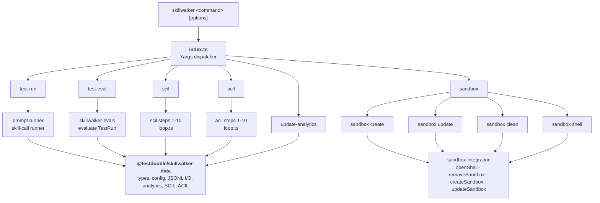

# CLI Package

> **Tier 5 · Contributor reference.** Internal documentation for the `@testdouble/skillwalker-cli` package — the CLI layer only: Yargs command registration, argument and flag parsing, and path resolution from `process.cwd()`. If you're a user looking for what commands and flags to run, see [Getting Started: Skill Trigger Accuracy](getting-started/skill-trigger-accuracy.md). For pipeline internals (test-run/test-eval steps, SCIL/ACIL loops, error hierarchy, path config), see [Execution Package](./execution.md).

This page documents the CLI boundary: the six top-level commands the `skillwalker` binary exposes, how each command builder parses its arguments and flags, how paths are resolved once via `createPathConfig(process.cwd())`, and how `SkillwalkerError` is caught for clean exit. The CLI owns no pipeline logic — every command is a thin wrapper that delegates to `@testdouble/skillwalker-execution` (test-run, test-eval, SCIL, ACIL) or `@testdouble/sandbox-integration` (sandbox lifecycle). Pipeline implementation, the numbered step files, and all core types live in [Execution Package](./execution.md).

The `@testdouble/skillwalker-cli` package is the command-line entry point for Skillwalker. It is a thin Yargs wrapper that parses arguments, resolves paths from `process.cwd()`, and delegates all pipeline orchestration to `@testdouble/skillwalker-execution`.

- **Last Updated:** 2026-09-23
- **Authors:**
  - River Bailey (river.bailey@testdouble.com)

## Summary

- Six top-level commands exposed via the `skillwalker` binary: `test-run`, `test-eval`, `scil`, `acil`, `update-analytics-data`, and `sandbox`. The Test Sandbox lifecycle lives under `sandbox` as four sub-commands: `sandbox create`, `sandbox update`, `sandbox clean`, and `sandbox shell`
- All test execution happens inside a Test Sandbox via `@testdouble/sandbox-integration`, with Claude invoked through `@testdouble/claude-integration`
- Two test runner types handle different test kinds: prompt tests (full Claude sessions) and skill-call tests (trigger detection with temporary stripped-down plugins)
- The SCIL (Skill Call Improvement Loop) command iteratively improves skill descriptions by running evaluation cycles and using Claude to generate better descriptions
- The ACIL (Agent Call Improvement Loop) command iteratively improves agent descriptions by running evaluation cycles and using Claude to generate better descriptions

Key files:
- `packages/cli/index.ts` — CLI entry point, Yargs command registration
- `packages/cli/src/commands/test-run.ts` — Test execution orchestrator
- `packages/cli/src/commands/test-eval.ts` — Evaluation pipeline
- `packages/cli/src/commands/scil.ts` — SCIL command entry point
- `packages/cli/src/commands/acil.ts` — ACIL command entry point

## Architecture

## Key Files

| File | Purpose |
|------|---------|
| `packages/cli/index.ts` | CLI entry point — registers all Yargs commands, handles `SkillwalkerError` |
| `packages/cli/src/paths.ts` | Singleton path resolution — exports `testsDir`, `repoRoot`, `outputDir`, `dataDir` |
| `packages/cli/src/commands/test-run.ts` | `test-run` command — delegates to `@testdouble/skillwalker-execution` test-run pipeline |
| `packages/cli/src/commands/test-eval.ts` | `test-eval` command — delegates to `@testdouble/skillwalker-execution` eval pipeline |
| `packages/cli/src/commands/scil.ts` | `scil` command — entry point for the Skill Call Improvement Loop |
| `packages/cli/src/commands/acil.ts` | `acil` command — entry point for the Agent Call Improvement Loop |
| `packages/cli/src/commands/update-analytics.ts` | `update-analytics-data` command — imports JSONL to Parquet |
| `packages/cli/src/commands/sandbox.ts` | `sandbox` parent command — registers the four sub-commands below |
| `packages/cli/src/commands/sandbox/shell.ts` | `sandbox shell` sub-command — opens interactive shell in Test Sandbox |
| `packages/cli/src/commands/sandbox/clean.ts` | `sandbox clean` sub-command — removes the Test Sandbox |
| `packages/cli/src/commands/sandbox/create.ts` | `sandbox create` sub-command — creates sandbox and authenticates via OAuth |
| `packages/cli/src/commands/sandbox/update.ts` | `sandbox update` sub-command — deletes the sandbox and recreates it from the latest Claude Code template |

## Core Types

All core types (`PathConfig`, `ScilConfig`, `AcilConfig`, `SkillFileContent`, `SkillwalkerError`, `ConfigNotFoundError`, `RunNotFoundError`) are defined in `@testdouble/skillwalker-execution`. See [execution.md](./execution.md) for type definitions.

## Implementation Details

### Command Delegation

Each command module in `packages/cli/src/commands/` is a thin Yargs wrapper that parses arguments, validates options, and delegates to `@testdouble/skillwalker-execution`:

- **test-run** — Calls the execution package's test-run pipeline (10-step orchestration, test runner dispatch, prompt and skill-call runners)
- **test-eval** — Calls the execution package's eval pipeline (run discovery, evaluation, result writing, re-eval marking)
- **scil** — Calls `runScilLoop()` from the execution package for iterative skill description improvement
- **acil** — Calls `runAcilLoop()` from the execution package for iterative agent description improvement
- **update-analytics-data** — Calls the execution package's analytics ingestion
- **sandbox create** / **sandbox update** / **sandbox clean** / **sandbox shell** — Delegate to `@testdouble/sandbox-integration` for sandbox lifecycle. The `sandbox` parent holds no logic of its own; it registers the four sub-commands and requires one of them

See [execution.md](./execution.md) for implementation details of each pipeline (test-run steps, test-eval steps, SCIL loop, ACIL loop, concurrency pool, scoring, error hierarchy).

### Error Handling

The CLI catches `SkillwalkerError` at the top level (`index.ts`) and writes the message to stderr with a clean exit code 1. All other errors propagate as unhandled exceptions. The error hierarchy (`SkillwalkerError`, `ConfigNotFoundError`, `RunNotFoundError`) is defined in `@testdouble/skillwalker-execution`.

## Configuration

| Option | Command | Description | Default |
|--------|---------|-------------|---------|
| `--eval` | `test-run` | Eval name (omit to run all) | all evals |
| `--test` | `test-run` | Filter to single test by name | none |
| `--debug` | `test-run`, `test-eval`, `scil` | Show sandbox/debug output | `false` |
| `--eval` | `scil`, `acil` | Eval name (required) | none |
| `--skill` | `scil` | Target skill in `plugin:skill` format | inferred |
| `--agent` | `acil` | Target agent in `plugin:agent` format | inferred |
| `--max-iterations` | `scil`, `acil` | Maximum improvement iterations | `5` |
| `--holdout` | `scil`, `acil` | Fraction held out for validation | `0` |
| `--concurrency` | `scil`, `acil` | Parallel sandbox exec calls | `1` |
| `--runs-per-query` | `scil`, `acil` | Runs per test case for majority vote | `1` |
| `--model` | `scil`, `acil` | Model for improvement prompt | `opus` |
| `--apply` | `scil`, `acil` | Auto-apply best description | `false` |
| `--output-dir` | `update-analytics-data` | Path to test output directory | `tests/output/` |
| `--data-dir` | `update-analytics-data` | Path to analytics data directory | `tests/analytics/` |
| `--version` | all | Print the CLI version: `packages/cli/package.json`'s version in a compiled binary, `dev` from source | — |

| Environment variable | Description | Default |
|----------------------|-------------|---------|
| `SKILLWALKER_SCRIPTS_DIR` | Folder holding `sandbox-run.sh` and `sandbox-extract.sh`. An installer sets it so the folder mounted into the sandbox keeps the same path across upgrades. See [Claude Integration](./claude-integration.md#sandbox-script-resolution). | beside the executable |

### Build and Release

`make build` runs `scripts/build.ts`, which compiles `skillwalker` and `skillwalker-web` into `build/` and copies the DuckDB native files and sandbox scripts beside them. Two details matter for a distributable build:

- **Version.** The build passes `packages/cli/package.json`'s `version` to `Bun.build` as the `SKILLWALKER_VERSION` define. `packages/cli/src/version.ts` reads it and falls back to `dev` when running from source.
- **Signing.** On macOS, `bun build --compile` appends the bundle after the linker has signed the executable, so the signature no longer matches the file and recent macOS releases kill it on launch. The build strips that signature, signs each binary ad hoc, and runs `codesign --verify`, failing the build if any step fails.

Pushing a `v*` tag runs `.github/workflows/release.yml`. It fails unless the tag matches `packages/cli/package.json`'s version, then builds and smoke tests on arm64 and x86_64 macOS runners. Each build folder is packaged as `skillwalker-<version>-darwin-<arch>.tar.gz` with a `.sha256` file, and all of them are attached to a draft GitHub Release.

## Testing

- `packages/cli/src/paths.test.ts` — Tests `createPathConfig` and `getAllEvals`
- `packages/cli/src/version.test.ts` — Tests the `dev` version fallback when running from source
- `packages/cli/src/compiled-binary.smoke.test.ts` — Runs the binaries in `build/` (`make build && bun run test:smoke`): `--version`, DuckDB loading, a Homebrew-style `bin` symlink into `libexec`, `SKILLWALKER_SCRIPTS_DIR`, and `codesign --verify` on macOS
- `packages/cli/src/commands/test-run.test.ts` — Tests `test-run` command builder and handler
- `packages/cli/src/commands/test-eval.test.ts` — Tests `test-eval` command builder and handler
- `packages/cli/src/commands/scil.test.ts` — Tests `scil` command builder and handler
- `packages/cli/src/commands/acil.test.ts` — Tests `acil` command builder and handler
- `packages/cli/src/commands/update-analytics.test.ts` — Tests `update-analytics-data` command
- `packages/cli/src/commands/sandbox/create.test.ts` — Tests `sandbox create` sub-command
- `packages/cli/src/commands/sandbox/update.test.ts` — Tests `sandbox update` sub-command
- `packages/cli/src/commands/sandbox/clean.test.ts` — Tests `sandbox clean` sub-command
- `packages/cli/src/commands/sandbox/shell.test.ts` — Tests `sandbox shell` sub-command

### Test Patterns

Test files are co-located with their source files. Tests use Vitest with the standard `describe`/`it` pattern. Pipeline step tests, test runner tests, eval step tests, and SCIL/ACIL step tests live in `packages/execution/` — see [execution.md](./execution.md).

## Related Documentation

- [Execution Package](./execution.md) — Execution orchestration layer that the CLI delegates to (test-run, test-eval, SCIL pipelines, error hierarchy, path config)
- [Skillwalker Architecture](./skillwalker-architecture.md) — System-wide architecture, package boundaries, and data flow
- [Evals Reference](./evals-reference.md) — How `tests.json` files are structured
- [Sandbox Integration](./sandbox-integration.md) — Test Sandbox API and consumer patterns
- [Skill Call Improvement Loop](./skill-call-improvement-loop.md) — Detailed SCIL algorithm and design
- [Parquet Schema](./parquet-schema.md) — Schema for analytics data produced by `update-analytics-data`
- [Data Package](./data.md) — Shared data layer: types, config parsing, JSONL I/O, DuckDB analytics, SCIL utilities
- [Evals Package](./evals.md) — Evaluation engine consumed by `test-eval` and SCIL commands
- [Claude Integration](./claude-integration.md) — Claude CLI wrapper API used for running prompts in the sandbox
- [Web Dashboard](./web.md) — Web dashboard that displays results produced by CLI commands
- [Test Fixtures](./test-fixtures.md) — Shared test fixture data used by CLI unit tests
- [Project Discovery](./project-discovery.md) — Repository-wide project scan including CLI package details

---

**Next:** [Execution Package](./execution.md) — the pipeline orchestration every command delegates to, plus all core type definitions.
**Related:** [Skillwalker Architecture](./skillwalker-architecture.md) — where the CLI layer sits in the package dependency graph.
