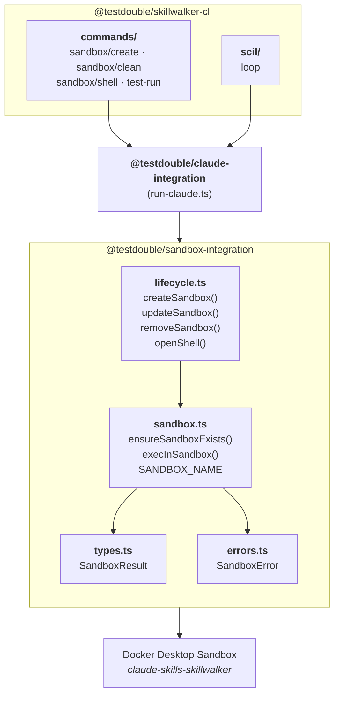

# Sandbox Integration Package

> **Tier 5 · Contributor reference.** Internal API deep-dive for the `@testdouble/sandbox-integration` package — the barrel exports, every public function signature, the consumer import map, and test patterns. If you're a user who just needs the sandbox set up before running tests, see [Getting Started: Skill Trigger Accuracy](getting-started/skill-trigger-accuracy.md).

This page is the typed reference for the package's public surface: each exported symbol, its signature and behavior, which consumer imports it, the error matrix, and the `Bun.spawn` mocking conventions for its tests. For the architecture-level walkthrough and the `sandbox-run.sh` script, see [Sandbox Integration](sandbox-integration.md).

The `@testdouble/sandbox-integration` package is the single point of contact for Docker Sandboxes via `sbx` in Skillwalker. It wraps the `sbx` CLI subcommands and exposes a typed TypeScript API for creating, removing, verifying, and executing commands inside Test Sandboxes.

- **Package:** `@testdouble/sandbox-integration` (v0.1.0, private)
- **Runtime:** Bun (ESNext target, strict TypeScript)
- **Test framework:** Vitest
- **Location:** `packages/sandbox-integration/`

## Purpose

No other package in Skillwalker spawns `sbx` processes directly. All Sandbox CLI access is funneled through this package, which provides two categories of functionality:

1. **Sandbox execution** -- verifying the sandbox exists and running commands inside it (`ensureSandboxExists`, `execInSandbox`)
2. **Lifecycle management** -- creating, removing, and opening interactive shells in the sandbox (`createSandbox`, `updateSandbox`, `removeSandbox`, `openShell`)

The package returns a clean `SandboxResult` type instead of exposing raw `Bun.spawn` process handles, giving consumers a stable interface decoupled from the process spawning implementation.

## Public API

All public symbols are re-exported from the barrel file `index.ts`:

```typescript
export { SANDBOX_NAME, ensureSandboxExists, execInSandbox } from './src/sandbox.js'
export { createSandbox, openShell, removeSandbox, updateSandbox } from './src/lifecycle.js'
export { SandboxError } from './src/errors.js'
export type { SandboxResult } from './src/types.js'
```

## Core Types

### SandboxResult

Return type of `execInSandbox`. Captures the full output of a command run inside the sandbox.

```typescript
interface SandboxResult {
  exitCode: number   // Process exit code; defaults to 1 when proc.exitCode is null
  stdout: string     // Full captured stdout
  stderr: string     // Full captured stderr
}
```

### SandboxError

Custom error class thrown by sandbox verification and lifecycle functions.

```typescript
class SandboxError extends Error {
  constructor(message: string, public exitCode: number | null)
  name: 'SandboxError'
}
```

## Constants

| Constant | Value | Description |
|----------|-------|-------------|
| `SANDBOX_NAME` | `'claude-skills-skillwalker'` | Name of the Docker Desktop sandbox used for all test execution |

## Module Reference

### sandbox.ts -- Sandbox Execution

#### ensureSandboxExists()

```typescript
async function ensureSandboxExists(requiredPaths: string[] = []): Promise<void>
```

Pre-flight check that the sandbox exists and mounts what the run needs. Runs `sbx ls --json`, finds the entry named `SANDBOX_NAME`, and checks that every path in `requiredPaths` is inside one of its workspaces (a trailing `:ro` on a listed workspace is ignored). `runEvals` and the SCIL and ACIL loops pass `[sandboxScriptsDir]`. A sandbox created before the scripts mount was added keeps its old workspaces, so this check fails it before any test runs instead of at the first `sbx exec`. Throws `SandboxError` with `exitCode: null` if the sandbox is not found, with a message directing the user to run `skillwalker sandbox create`.

**Consumers:**
- `cli/src/commands/test-run.ts` -- before the per-eval test loop
- `cli/src/scil/loop.ts` -- before the SCIL iteration loop
- `lifecycle.ts: openShell()` -- before spawning an interactive bash session

#### execInSandbox()

```typescript
async function execInSandbox(
  command: string,
  args: string[],
  scaffoldPath: string | null,
  debug: boolean
): Promise<SandboxResult>
```

Primary execution function. Builds and spawns the command `sbx exec claude-skills-skillwalker <command> <scaffoldPath> ...args`.

**Output handling:**
- stdout is streamed chunk-by-chunk via a `ReadableStream` reader. When `debug` is `true`, each chunk is also written to `process.stdout` in real time.
- stderr is drained in parallel via `new Response(stream).text()`. When `debug` is `true` and stderr is non-empty, it is written to `process.stderr`.
- Both streams are fully captured regardless of the `debug` flag.
- Does not throw on non-zero exit codes; the caller inspects `SandboxResult.exitCode`.

`sbx exec` exits 0 even when it cannot start the command, printing `OCI runtime exec failed: ...` instead (for example, when the script's host path is outside every sandbox workspace). `execInSandbox` throws `SandboxError` when any stdout or stderr line starts with that message, pointing the user at `sandbox update`.

**Consumer:** `claude-integration/src/run-claude.ts` imports `execInSandbox` as the execution primitive for all Claude invocations inside the sandbox.

### lifecycle.ts -- Lifecycle Management

#### createSandbox()

```typescript
async function createSandbox(repoRoot: string, extraWorkspaces: string[] = []): Promise<void>
```

Checks whether the sandbox already exists via an internal `sandboxExists()` helper (runs `sbx ls --quiet`). If found, prints a help message to stderr explaining how to recreate it, and returns early. Otherwise, spawns `sbx run --name claude-skills-skillwalker claude <repoRoot> [<extraWorkspace>:ro ...]` with inherited stdio for interactive OAuth login. Prints progress messages to stderr. Throws `SandboxError` if `sbx run` exits non-zero.

`extraWorkspaces` are mounted read-only after `repoRoot` (`<path>:ro`); any already inside `repoRoot` are skipped. The CLI passes the directory holding `sandbox-run.sh` and `sandbox-extract.sh` (`sandboxScriptsDir` from `@testdouble/claude-integration`, or `SKILLWALKER_SCRIPTS_DIR` when set). `execInSandbox` runs those scripts by their host path, and the sandbox only sees host paths under a mounted workspace, so without this mount every test run fails whenever the target repo is not the skillwalker repo.

**Consumer:** `cli/src/commands/sandbox/create.ts`

#### removeSandbox()

```typescript
async function removeSandbox(): Promise<void>
```

Runs `sbx rm --force claude-skills-skillwalker`. Drains stdout and stderr in parallel using a `drainStream` helper. Throws `SandboxError` with the process exit code and captured output on non-zero exit.

**Consumer:** `cli/src/commands/sandbox/clean.ts` -- catches `SandboxError` and re-throws as `SkillwalkerError`

#### updateSandbox()

```typescript
async function updateSandbox(repoRoot: string, extraWorkspaces: string[] = []): Promise<void>
```

Replaces the sandbox with one built from the latest Claude Code template. `sbx` has no pull command and reuses a cached template image, so this function:

1. Removes the sandbox with `removeSandbox()`, if it exists.
2. Lists templates with `sbx template ls` and removes each cached image whose repository is `docker/sandbox-templates` and whose tag starts with `claude-code`, using `sbx template rm <image id>`.
3. Calls `createSandbox(repoRoot, extraWorkspaces)`, which makes `sbx run` fetch the current template.

`sbx template ls` can list one image under several IDs, and removing the first ID removes them all. A later `rm` that reports `no template image` is therefore treated as already removed. Any other listing or removal failure throws `SandboxError`.

**Consumer:** `cli/src/commands/sandbox/update.ts` -- catches `SandboxError` and re-throws as `SkillwalkerError`

#### openShell()

```typescript
async function openShell(): Promise<void>
```

Calls `ensureSandboxExists()` first, then spawns `sbx exec -it claude-skills-skillwalker bash` with inherited stdio for an interactive debugging session.

**Consumer:** `cli/src/commands/sandbox/shell.ts`

### errors.ts -- Error Types

Contains the `SandboxError` class (see Core Types above). Extends `Error` with an explicit `name` property set to `'SandboxError'` and an `exitCode` field that accepts `number | null`.

### types.ts -- Type Definitions

Contains the `SandboxResult` interface (see Core Types above).

## Architecture



**Dependency flow:** CLI commands and the SCIL loop import lifecycle and verification functions directly. The `claude-integration` package imports `execInSandbox` as the execution primitive. All Sandbox CLI access bottlenecks through this package.

## Consumer Import Map

| Consumer | Imports |
|----------|---------|
| `cli/src/commands/sandbox/create.ts` | `createSandbox` |
| `cli/src/commands/sandbox/update.ts` | `updateSandbox`, `SandboxError` |
| `cli/src/commands/sandbox/clean.ts` | `removeSandbox`, `SANDBOX_NAME`, `SandboxError` |
| `cli/src/commands/sandbox/shell.ts` | `openShell` |
| `cli/src/commands/test-run.ts` | `ensureSandboxExists` |
| `cli/src/scil/loop.ts` | `ensureSandboxExists` |
| `claude-integration/src/run-claude.ts` | `execInSandbox` |

## Error Handling

| Scenario | Error Type | Behavior |
|----------|------------|----------|
| Sandbox not found by `ensureSandboxExists` | `SandboxError` (exitCode: `null`) | Thrown with message suggesting `skillwalker sandbox create` |
| Required path not mounted, checked by `ensureSandboxExists` | `SandboxError` (exitCode: `null`) | Thrown naming the unmounted path, with a hint to run `skillwalker sandbox update` from the target repo |
| `sbx rm` fails | `SandboxError` (exitCode: process code) | Thrown with stdout+stderr in message |
| `sbx exec` prints `OCI runtime exec failed` (exits 0) | `SandboxError` (exitCode: process code) | Thrown with the sbx output and a hint to run `skillwalker sandbox update` from the target repo |
| Non-zero exit from `execInSandbox` | No error thrown | Returned in `SandboxResult.exitCode`; caller decides |
| `proc.exitCode` is null in `execInSandbox` | No error thrown | Defaults to `1` in `SandboxResult` |

## Testing

Three test files with full coverage of the public API:

| File | Covers |
|------|--------|
| `src/errors.test.ts` | `SandboxError` construction, properties, inheritance |
| `src/sandbox.test.ts` | `ensureSandboxExists`, `execInSandbox` |
| `src/lifecycle.test.ts` | `removeSandbox`, `createSandbox`, `updateSandbox`, `openShell` |

### Test Patterns

**Bun.spawn mocking:** Tests stub the global `Bun` object via `vi.stubGlobal` in `beforeEach` and restore in `afterEach`:

```typescript
beforeEach(() => {
  vi.stubGlobal('Bun', { spawn: vi.fn() })
})
afterEach(() => {
  vi.unstubAllGlobals()
  vi.restoreAllMocks()
})
```

**ReadableStream mocks:** Mock return values use real `ReadableStream` instances so they work with `new Response(stream).text()`:

```typescript
function makeStream(content: string): ReadableStream<Uint8Array> {
  return new ReadableStream({
    start(controller) {
      if (content) controller.enqueue(new TextEncoder().encode(content))
      controller.close()
    }
  })
}
```

**Dynamic imports:** Modules under test are imported dynamically inside each `it` block via `await import('./sandbox.js')` so that `Bun.spawn` stubs are in place before module-level code executes.

**Module mocking:** `lifecycle.test.ts` mocks `sandbox.js` via `vi.mock` to isolate lifecycle functions from the sandbox module, providing a controlled `ensureSandboxExists` stub.

## File Inventory

| File | Purpose |
|------|---------|
| `package.json` | Package metadata (name, version, devDependencies) |
| `tsconfig.json` | TypeScript config (ESNext, bundler resolution, strict, bun-types) |
| `index.ts` | Barrel re-export of all public symbols |
| `src/types.ts` | `SandboxResult` interface |
| `src/errors.ts` | `SandboxError` class |
| `src/sandbox.ts` | `SANDBOX_NAME`, `ensureSandboxExists`, `execInSandbox` |
| `src/lifecycle.ts` | `createSandbox`, `updateSandbox`, `removeSandbox`, `openShell` |
| `src/errors.test.ts` | Unit tests for `SandboxError` |
| `src/sandbox.test.ts` | Unit tests for sandbox execution functions |
| `src/lifecycle.test.ts` | Unit tests for lifecycle management functions |

## Related Documentation

- [Sandbox Integration](sandbox-integration.md) -- Original architecture and consumer reference
- [Test Scaffolding](test-scaffolding.md) -- How scaffolds provide project context in the Test Sandbox
- [Skillwalker Architecture](skillwalker-architecture.md) -- System architecture and package boundaries
- [Cross-Runtime Meta Property Resolution](coding-standards/cross-runtime-meta-resolution.md) -- Coding standard for `import.meta` fallback chains

---

**Next:** [Sandbox Integration](sandbox-integration.md) -- the architecture walkthrough and the `sandbox-run.sh` script that runs inside the container.
**Related:** [Skillwalker Architecture](skillwalker-architecture.md) -- where this package sits in the dependency graph.
