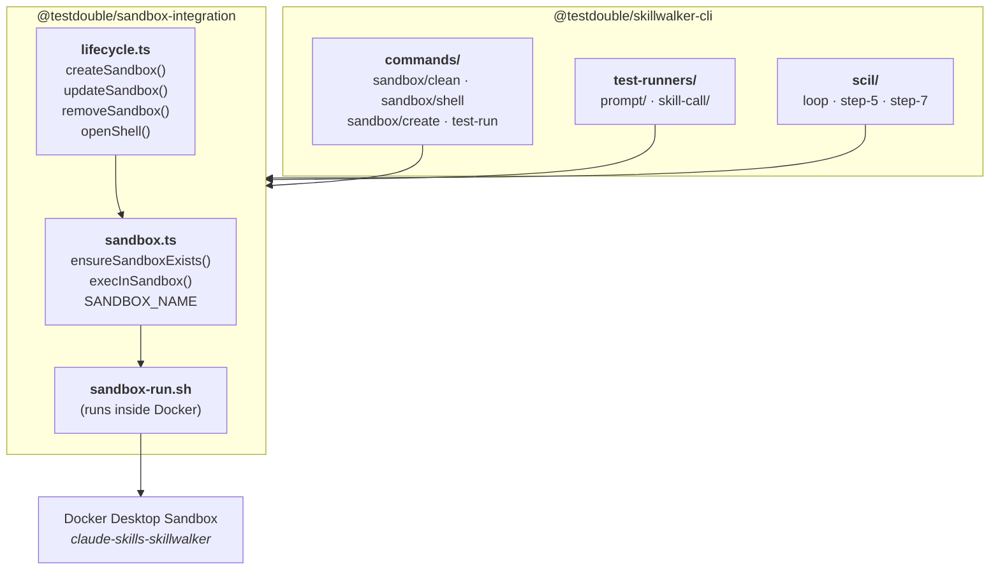

# Sandbox Integration

> **Tier 5 · Contributor reference.** Internal documentation for the `@testdouble/sandbox-integration` package — the sandbox API, the `sandbox-run.sh` script, error handling, and test patterns. If you're a user who just needs the sandbox set up before running tests, see [Getting Started: Skill Trigger Accuracy](getting-started/skill-trigger-accuracy.md).

This page tells you how Skillwalker talks to Docker Sandboxes via `sbx`: the functions you call to create, verify, run inside, and tear down the Test Sandbox; what `sandbox-run.sh` does inside the sandbox; how errors propagate to each consumer; and how to mock `Bun.spawn` when testing this package. For the typed public-API deep dive, see [Sandbox Integration Package](sandbox-integration-package.md).

Centralized package for all Test Sandbox interactions in Skillwalker — creating, removing, and executing commands inside sandboxes.

- **Last Updated:** 2026-05-15
- **Authors:**
  - River Bailey

## Summary

- The `@testdouble/sandbox-integration` package is the single point of contact for all Sandbox CLI commands in Skillwalker. No other package spawns `sbx` processes directly.
- Provides two categories of functions: **sandbox execution** (`ensureSandboxExists`, `execInSandbox`) for running Claude inside the sandbox, and **lifecycle management** (`createSandbox`, `updateSandbox`, `removeSandbox`, `openShell`) for managing the sandbox itself.
- Uses Docker Desktop sandboxes (not traditional containers) via the `sbx` CLI subcommands.
- Returns a clean `SandboxResult` type instead of exposing raw `Bun.spawn` process handles.

Key files:
- `packages/sandbox-integration/index.ts` — Public API barrel export
- `packages/sandbox-integration/src/sandbox.ts` — `ensureSandboxExists`, `execInSandbox`, `SANDBOX_NAME`
- `packages/sandbox-integration/src/lifecycle.ts` — `createSandbox`, `updateSandbox`, `removeSandbox`, `openShell`
- `packages/sandbox-integration/sandbox-run.sh` — Shell script executed inside the sandbox to prepare the working directory and invoke Claude

## Architecture



## Key Files

| File | Purpose |
|------|---------|
| `packages/sandbox-integration/package.json` | Package metadata (`@testdouble/sandbox-integration`) |
| `packages/sandbox-integration/index.ts` | Barrel re-export of all public symbols |
| `packages/sandbox-integration/src/sandbox.ts` | `SANDBOX_NAME`, `ensureSandboxExists`, `execInSandbox` |
| `packages/sandbox-integration/src/lifecycle.ts` | `createSandbox`, `updateSandbox`, `removeSandbox`, `openShell` |
| `packages/sandbox-integration/src/types.ts` | `SandboxResult` interface |
| `packages/sandbox-integration/src/errors.ts` | `SandboxError` class |
| `packages/sandbox-integration/sandbox-run.sh` | Scaffold setup and Claude invocation inside the sandbox |
| `packages/sandbox-integration/src/sandbox.test.ts` | Tests for sandbox execution functions |
| `packages/sandbox-integration/src/lifecycle.test.ts` | Tests for lifecycle management functions |
| `packages/sandbox-integration/src/errors.test.ts` | Tests for `SandboxError` |

## Core Types

```typescript
// types.ts — Return type of execInSandbox
export interface SandboxResult {
  exitCode: number   // proc.exitCode, defaults to 1 if null
  stdout: string     // full captured stdout
  stderr: string     // full captured stderr
}

// errors.ts — Thrown by sandbox and lifecycle functions
export class SandboxError extends Error {
  constructor(message: string, public exitCode: number | null) {
    super(message)
    this.name = 'SandboxError'
  }
}
```

## Constants

| Constant | Value | Description |
|----------|-------|-------------|
| `SANDBOX_NAME` | `'claude-skills-skillwalker'` | Name of the Docker Desktop sandbox used for all test execution |

## Implementation Details

### Sandbox Execution

#### ensureSandboxExists

Pre-flight check that the sandbox exists and mounts what the run needs. Runs `sbx ls --json`, finds the entry named `SANDBOX_NAME`, and checks that every path in `requiredPaths` is inside one of its workspaces (a trailing `:ro` on a listed workspace is ignored). `runEvals` and the SCIL and ACIL loops pass `[sandboxScriptsDir]`. A sandbox created before the scripts mount was added keeps its old workspaces, so this check fails it before any test runs instead of at the first `sbx exec`. Throws `SandboxError` with `exitCode: null` if not found.

Called by:
- `commands/test-run.ts` — before the per-eval test loop
- `scil/loop.ts` — before the SCIL iteration loop
- `lifecycle.ts: openShell()` — before spawning an interactive bash session

#### execInSandbox

The primary execution function. Spawns a Claude process inside the Test Sandbox and captures all output.

```typescript
export async function execInSandbox(
  claudeArgs: string[],
  scaffoldPath: string | null,
  debug: boolean
): Promise<SandboxResult>
```

**Command built:** `sbx exec claude-skills-skillwalker <sandboxRunScript> <scaffoldPath> ...claudeArgs`

**Output handling:**
- stdout is streamed chunk-by-chunk via a `ReadableStream` reader. When `debug` is `true`, each chunk is also written to `process.stdout` in real time.
- stderr is drained in parallel via `new Response(stream).text()`. When `debug` is `true` and stderr is non-empty, it is written to `process.stderr`.
- Both streams are fully captured regardless of the `debug` flag.

`sbx exec` exits 0 even when it cannot start the command, printing `OCI runtime exec failed: ...` instead (for example, when the script's host path is outside every sandbox workspace). `execInSandbox` throws `SandboxError` when any stdout or stderr line starts with that message, pointing the user at `sandbox update`.

**Consumers and their claude args patterns:**

| Consumer | Key Args | Scaffold |
|----------|----------|----------|
| Prompt test runner | `--dangerously-skip-permissions`, `--plugin-dir` (all plugins), `--print` | From test config |
| Skill-call test runner | `--plugin-dir` (temp single-skill plugin), `--print` | From test config |
| SCIL step-5 (runEval) | `--plugin-dir` (temp plugin), `--print` | From test config |
| SCIL step-7 (improveDescription) | `--model`, `--print` (no plugins) | `null` |
| LLM judge (step-3b) | `--model`, `--print` (no plugins) | `null` |

### sandbox-run.sh

Shell script that runs inside the Test Sandbox. Receives `SCAFFOLD_PATH` as `$1` and remaining args are passed through to `claude`.

```sh
#!/bin/sh
set -e

SCAFFOLD_PATH="$1"
shift  # remaining args are claude args

if [ -n "$SCAFFOLD_PATH" ] && [ -d "$SCAFFOLD_PATH" ]; then
  WORK=$(mktemp -d)
  cp -r "$SCAFFOLD_PATH/." "$WORK/"
  cd "$WORK"
  git init -b main -q
  git config user.email "test@test.com"
  git config user.name "Test"
  git add -A
  git commit -q -m "Initial commit" --allow-empty
fi

exec claude "$@"
```

When a scaffold path is provided, it copies the scaffold into a fresh temp directory and initializes a git repository with a single commit. This gives Claude a clean, committed working tree to operate in. When no scaffold is needed, `execInSandbox` passes an empty string and the script skips directly to `exec claude`.

### Lifecycle Management

#### createSandbox

```typescript
export async function createSandbox(repoRoot: string, extraWorkspaces: string[] = []): Promise<void>
```

Checks if the sandbox already exists via an internal `sandboxExists()` helper. If it does, prints a help message to stderr and returns. Otherwise, spawns `sbx run --name claude-skills-skillwalker claude <repoRoot> [<extraWorkspace>:ro ...]` with inherited stdio for interactive OAuth login. If `sbx run` exits non-zero, it throws `SandboxError` instead of reporting the sandbox as ready.

`extraWorkspaces` are mounted read-only after `repoRoot` (`<path>:ro`); any already inside `repoRoot` are skipped. The CLI passes the directory holding `sandbox-run.sh` and `sandbox-extract.sh` (`sandboxScriptsDir` from `@testdouble/claude-integration`). `execInSandbox` runs those scripts by their host path, and the sandbox only sees host paths under a mounted workspace, so without this mount every test run fails whenever the target repo is not the skillwalker repo.

Called by `commands/sandbox/create.ts`.

#### updateSandbox

```typescript
export async function updateSandbox(repoRoot: string, extraWorkspaces: string[] = []): Promise<void>
```

Removes the sandbox if it exists, then removes every cached `docker/sandbox-templates` image tagged `claude-code*` (found with `sbx template ls`). Finally it calls `createSandbox` with the same arguments, so `sbx run` fetches the latest Claude Code template. `sbx` has no pull command, so deleting the cached image is the only way to get a newer one. An `rm` that reports `no template image` counts as already removed, because `sbx template ls` can list one image under several IDs. Any other listing or removal failure throws `SandboxError`.

Called by `commands/sandbox/update.ts`, which catches `SandboxError` and re-throws as `SkillwalkerError`.

#### removeSandbox

```typescript
export async function removeSandbox(): Promise<void>
```

Runs `sbx rm --force claude-skills-skillwalker`. Drains stdout and stderr in parallel. Throws `SandboxError` with the process exit code on failure.

Called by `commands/sandbox/clean.ts`, which catches `SandboxError` and re-throws as `SkillwalkerError`.

#### openShell

```typescript
export async function openShell(): Promise<void>
```

Calls `ensureSandboxExists()` first, then spawns `sbx exec -it claude-skills-skillwalker bash` with inherited stdio for an interactive debugging session.

Called by `commands/sandbox/shell.ts`.

### Cross-Runtime Path Resolution

The path to `sandbox-run.sh` is resolved at module scope using the project's cross-runtime fallback chain:

```typescript
const currentDir = import.meta.dir ?? import.meta.dirname ?? path.dirname(new URL(import.meta.url).pathname)
const sandboxRunScript = path.resolve(currentDir, '..', 'sandbox-run.sh')
```

- `import.meta.dir` — Bun runtime
- `import.meta.dirname` — Node / Vitest
- `path.dirname(new URL(import.meta.url).pathname)` — Universal ESM fallback

See [Cross-Runtime Meta Property Resolution](coding-standards/cross-runtime-meta-resolution.md) for the full standard.

## Error Handling

| Scenario | Error Type | Behavior |
|----------|------------|----------|
| Sandbox not found by `ensureSandboxExists` | `SandboxError` (exitCode: `null`) | Thrown with message suggesting `./build/skillwalker sandbox create` |
| Required path not mounted, checked by `ensureSandboxExists` | `SandboxError` (exitCode: `null`) | Thrown naming the unmounted path, with a hint to run `skillwalker sandbox update` from the target repo |
| `sbx rm` fails | `SandboxError` (exitCode: process code) | Thrown with stdout+stderr in message |
| `sbx exec` prints `OCI runtime exec failed` (exits 0) | `SandboxError` (exitCode: process code) | Thrown with the sbx output and a hint to run `skillwalker sandbox update` from the target repo |
| Non-zero exit code from `execInSandbox` | No error thrown | Returned in `SandboxResult.exitCode`; caller decides |
| `execInSandbox` with `proc.exitCode` null | No error thrown | `exitCode` defaults to `1` in `SandboxResult` |

**Consumer error handling patterns:**

| Layer | Pattern |
|-------|---------|
| CLI commands (`clean.ts`) | Catches `SandboxError`, re-throws as `SkillwalkerError` |
| Pre-flight checks (`test-run.ts`, `loop.ts`) and test runners | No catch — `SandboxError` propagates to `cli/index.ts`, which prints `Error: <message>` and exits 1 |
| Test runners (`prompt/`, `skill-call/`) | Checks `exitCode` on `SandboxResult`, increments failure counter |
| LLM judge (`step-3b`) | Catches all errors, records `status: 'infrastructure-error'` in results |
| SCIL step-5 | Catches errors per work-item, logs to stderr, continues |

## Testing

- `packages/sandbox-integration/src/errors.test.ts` — `SandboxError` construction and properties
- `packages/sandbox-integration/src/sandbox.test.ts` — `ensureSandboxExists` and `execInSandbox` with mocked `Bun.spawn`
- `packages/sandbox-integration/src/lifecycle.test.ts` — `removeSandbox`, `createSandbox`, `updateSandbox`, `openShell` with mocked `Bun.spawn` and `sandbox.js`

### Test Patterns

`Bun.spawn` is mocked via `vi.stubGlobal`:

```typescript
beforeEach(() => {
  vi.stubGlobal('Bun', { spawn: vi.fn() })
})
afterEach(() => {
  vi.unstubAllGlobals()
  vi.restoreAllMocks()
})
```

Mock return values use real `ReadableStream` instances (not fake objects) so they work with `new Response(stream).text()`:

```typescript
function makeStream(content: string): ReadableStream<Uint8Array> {
  return new ReadableStream({
    start(controller) {
      if (content) controller.enqueue(new TextEncoder().encode(content))
      controller.close()
    }
  })
}
```

Modules under test are imported dynamically inside each `it` block via `await import('./sandbox.js')` so that `Bun.spawn` stubs are in place before the module-level `import.meta` resolution runs.

## Troubleshooting

### Sandbox not found

If `ensureSandboxExists` throws `SandboxError`, run:

1. `./build/skillwalker sandbox create` — creates the sandbox and completes OAuth
2. Verify with `sbx ls --quiet` — should list `claude-skills-skillwalker`

### Sandbox does not mount a required path

If `ensureSandboxExists` reports that the sandbox does not mount a path, the sandbox predates that mount. From the target repo, run `./build/skillwalker sandbox update`, then verify with `sbx ls --json` that `claude-skills-skillwalker` lists both the target repo and the scripts directory.

### Sandbox already exists during setup

`createSandbox` returns early with a help message. To recreate:

1. `sbx rm --force claude-skills-skillwalker`
2. `./build/skillwalker sandbox create`

To recreate it from the latest Claude Code template instead, run `./build/skillwalker sandbox update`.

### Tests fail with "Cannot read properties of undefined (reading 'exited')"

This means a `Bun.spawn` mock is missing a return value. Ensure every `spawn` call in the test has a corresponding `mockReturnValue` or `mockReturnValueOnce` with at least `{ exited: Promise.resolve() }`.

## Related Documentation

- [Test Scaffolding](test-scaffolding.md) — How scaffolds provide project context in the Test Sandbox
- [LLM Judge](llm-judge.md) — Judge evaluation runs inside the sandbox via `execInSandbox`
- [Evals Reference](evals-reference.md) — Test case config including scaffold and model fields consumed by `execInSandbox`
- [Skill Call Improvement Loop](skill-call-improvement-loop.md) — SCIL uses `ensureSandboxExists` and `execInSandbox`
- [Skip Permissions in Test Sandbox](adrs/20260326084800-skip-permissions-in-test-sandbox.md) — ADR on using `--dangerously-skip-permissions` inside the sandbox
- [Cross-Runtime Meta Property Resolution](coding-standards/cross-runtime-meta-resolution.md) — Coding standard for the `import.meta` fallback chain used in this package
- [Claude Integration](./claude-integration.md) — Higher-level Claude CLI wrapper that delegates to this package via `execInSandbox`

---

**Next:** [Sandbox Integration Package](./sandbox-integration-package.md) — the typed public-API deep dive: barrel exports, consumer import map, and file inventory.
**Related:** [Claude Integration](./claude-integration.md) — the layer directly above this one.
