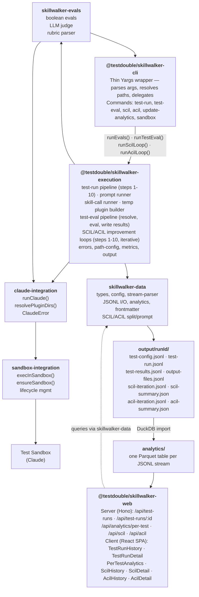
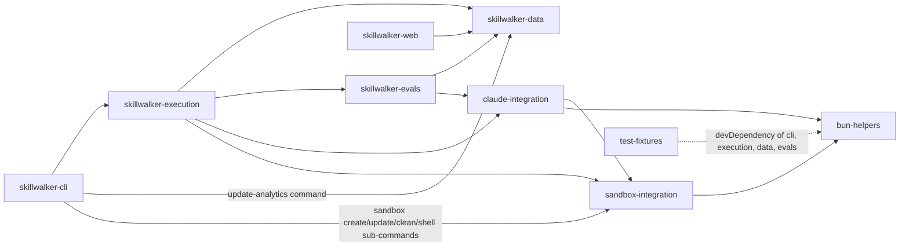
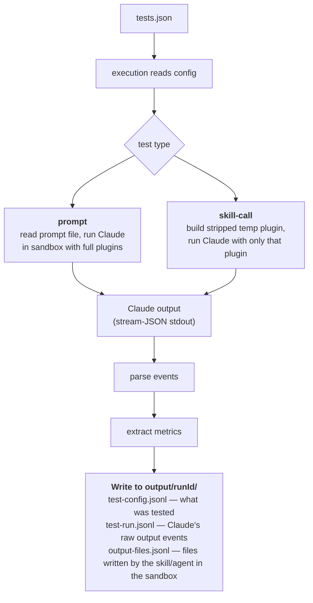
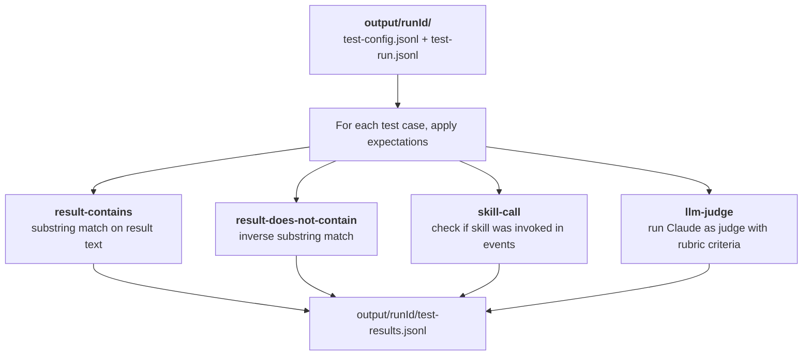
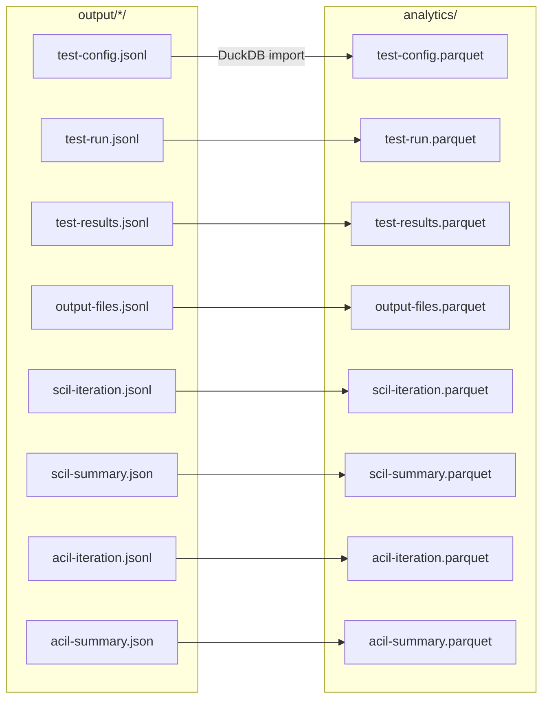

# Skillwalker Architecture

> **Tier 5 · Contributor reference.** Internal documentation for the Skillwalker monorepo as a whole — package boundaries, the dependency graph, and end-to-end data flow. If you're a user looking to run an evaluation, see [Getting Started: Skill Trigger Accuracy](getting-started/skill-trigger-accuracy.md).

This page maps the whole Skillwalker so you can locate the package and module that owns a change. It covers the nine workspace packages and their layering, the package dependency rules you must not violate, the four-stage data flow (execution → evaluation → analytics → dashboard), and the steps to add a new package.

Skillwalker is a monorepo workspace that executes AI skill evaluations inside Test Sandboxes, stores results as JSONL/Parquet, and serves a web dashboard for analysis.

- **Last Updated:** 2026-05-15
- **Authors:**
  - River Bailey (river@testdouble.com)

## System Summary

- Nine workspace packages under `packages/` form a layered architecture: CLI (thin Yargs wrapper), execution orchestration, shared data layer, evaluation logic, Claude CLI integration, Test Sandbox integration, web dashboard, cross-runtime utilities, and test fixtures
- Evals defined in `evals/` drive the system — each eval contains a `tests.json` config, prompt files, optional rubrics, and optional scaffolds
- Data flows through three stages: **execution** (execution package runs Claude in Docker via CLI commands, writes JSONL to `output/`), **evaluation** (execution package scores results via skillwalker-evals, appends to JSONL), and **analysis** (DuckDB imports JSONL to Parquet in `analytics/`, web serves queries over it)
- All Claude invocations happen inside a named Test Sandbox (`claude-skills-skillwalker`), providing filesystem isolation and reproducibility

Key files:
- `packages/cli/index.ts` — CLI entry point (compiled to `./build/skillwalker` binary)
- `packages/execution/index.ts` — Execution orchestration (test-run, test-eval, SCIL/ACIL pipelines)
- `packages/data/index.ts` — Shared data layer (types, config parsing, JSONL I/O, DuckDB analytics)
- `packages/evals/index.ts` — Evaluation logic (boolean evals + LLM judge)
- `packages/claude-integration/index.ts` — Claude CLI execution API (options, plugin dirs, error handling)
- `packages/sandbox-integration/index.ts` — Test Sandbox execution API
- `packages/web/src/server/index.ts` — Web dashboard server (compiled to `./build/skillwalker-web` binary)

## Architecture



### Dependency Graph (packages only)



## Packages

### @testdouble/skillwalker-cli (`packages/cli/`)

The command-line entry point. A thin Yargs wrapper that parses arguments, resolves paths from `process.cwd()`, and delegates all real work to `skillwalker-execution`. Compiled to a `./build/skillwalker` binary by `scripts/build.ts`.

**Boundary:** Command parsing, path resolution from `process.cwd()`, and Yargs configuration live here. The CLI owns no pipeline logic, no test runners, no SCIL/ACIL steps — it calls `runEvals()`, `runTestEval()`, `runScilLoop()`, and `runAcilLoop()` from `skillwalker-execution` and passes path values as parameters. Direct package dependencies beyond `skillwalker-execution` exist only for commands that don't go through the execution layer: `sandbox-integration` (the `sandbox` sub-commands) and `skillwalker-data` (update-analytics).

**Commands:**

| Command | Purpose | Delegates to |
|---------|---------|-------------|
| `test-run` | Execute evals against Claude in Test Sandbox | `runEvals()` |
| `test-eval` | Evaluate stored run output against expectations | `runTestEval()` |
| `scil` | Iterative skill-call description improvement loop | `runScilLoop()` |
| `acil` | Iterative agent-call description improvement loop | `runAcilLoop()` |
| `update-analytics` | Import JSONL output to Parquet via DuckDB | `skillwalker-data` directly |
| `sandbox create` | Create the Test Sandbox | `sandbox-integration` directly |
| `sandbox update` | Recreate the Test Sandbox from the latest Claude Code template | `sandbox-integration` directly |
| `sandbox clean` | Remove the Test Sandbox | `sandbox-integration` directly |
| `sandbox shell` | Open an interactive bash session in the Test Sandbox | `sandbox-integration` directly |

**Internal structure:**

- `src/commands/` — One file per Yargs command (thin handlers)
- `src/paths.ts` — Singleton path resolution via `createPathConfig(process.cwd())` from `skillwalker-execution`

### @testdouble/skillwalker-execution (`packages/execution/`)

The execution orchestration layer. Owns all test execution pipelines, the SCIL/ACIL improvement loops, evaluation orchestration, error hierarchy, and path config. Extracted from the CLI to enforce a clean separation between argument parsing and execution logic.

**Boundary:** All pipeline orchestration, step sequencing, test runner dispatch, SCIL/ACIL loop iteration, evaluation result processing, and error hierarchy lives here. The execution package never calls `process.cwd()` — all filesystem paths arrive as explicit function parameters. It coordinates the lower-level packages: `skillwalker-data` for types and I/O, `skillwalker-evals` for evaluation logic, `claude-integration` for running Claude, and `sandbox-integration` for sandbox management.

**Key exports:**

| Export | Purpose |
|--------|---------|
| `runEvals(opts)` | Orchestrate the full test-run pipeline (steps 1-10) |
| `runTestEval(opts)` | Orchestrate the test evaluation pipeline |
| `runScilLoop(config)` | Orchestrate the iterative SCIL improvement loop |
| `runAcilLoop(config)` | Orchestrate the iterative ACIL improvement loop |
| `SkillwalkerError`, `ConfigNotFoundError`, `RunNotFoundError` | Error hierarchy |
| `createPathConfig(rootDir)` | Derive all path constants from a root directory |
| `exitWithResult(failures)` | Exit process with 0 or 1 based on failure count |
| `getReEvaluatedRuns`, `markAsReEvaluated`, `clearReEvaluatedRuns` | Re-eval tracking (delegates to skillwalker-data) |

**Internal structure:**

- `src/evals/` — `runEvals()` orchestrator
- `src/test-eval/` — `runTestEval()` orchestrator and result conversion helpers
- `src/scil/` — SCIL loop orchestrator + numbered step files (steps 1-10)
- `src/acil/` — ACIL loop orchestrator + numbered step files
- `src/test-runners/steps/` — Numbered step files for the test-run pipeline
- `src/test-runners/prompt/` — Prompt-type test execution
- `src/test-runners/skill-call/` — Skill-call test execution + temp plugin builder
- `src/test-eval-steps/` — Steps for the eval pipeline
- `src/lib/` — Errors, path-config, metrics accumulation, output writing

### @testdouble/skillwalker-data (`packages/data/`)

The shared data layer. Owns all type definitions, configuration parsing, serialization formats, DuckDB queries, and domain logic that is not evaluation-specific.

**Boundary:** If it defines a type, reads/writes JSONL, parses Claude's stream-JSON output, manipulates YAML frontmatter, queries DuckDB, or manages Parquet files — it belongs here. This package has no CLI concerns (no argument parsing, no console output, no process management) and no evaluation logic (no pass/fail decisions).

**Modules:**

| Module | Responsibility |
|--------|---------------|
| `types.ts` | All shared domain types and interfaces — the canonical contract |
| `config.ts` | `tests.json` parsing, normalization, scaffold validation, plugin flag building |
| `stream-parser.ts` | Parse Claude's `--output-format stream-json` stdout into typed events |
| `jsonl-writer.ts` | Append-based writers for `test-config.jsonl`, `test-run.jsonl`, `test-results.jsonl` |
| `jsonl-reader.ts` | Line-by-line JSONL readers |
| `analytics.ts` | DuckDB JSONL-to-Parquet import + SQL queries for web dashboard |
| `connection.ts` | DuckDB instance cache and connection lifecycle (`withConnection`) |
| `run-status.ts` | SCIL/ACIL-specific DuckDB queries over Parquet |
| `skill-frontmatter.ts` | YAML frontmatter parsing, description replacement, sanitization |
| `scil-split.ts` | Stratified train/test split with seeded PRNG |
| `scil-prompt.ts` | LLM prompt builder for SCIL description improvement |
| `acil-prompt.ts` | LLM prompt builder for ACIL description improvement |
| `phase.ts` | Phase assignment and phase-specific prompt instructions for divergent-convergent iteration |
| `re-eval-marker.ts` | Tracks re-evaluated run IDs for Parquet upsert |

### @testdouble/skillwalker-evals (`packages/evals/`)

The evaluation engine. Applies expectations to stored test output and produces pass/fail results.

**Boundary:** All evaluation logic — comparing Claude's output against expected outcomes — lives here. This includes both deterministic boolean evaluations and non-deterministic LLM-judge evaluations. The evals package reads test output (via `skillwalker-data`) and invokes Claude for LLM judging (via `claude-integration`), but never writes JSONL directly — it returns typed `EvalResult` objects for the CLI to persist.

**Modules:**

| Module | Responsibility |
|--------|---------------|
| `evaluate.ts` | `evaluateTestRun()` — main orchestrator, dispatches to boolean + LLM judge |
| `boolean-evals.ts` | `evaluateResultContains`, `evaluateResultDoesNotContain`, `evaluateSkillCall` |
| `llm-judge-eval.ts` | Runs Claude as a judge with a rubric, scores criteria, computes aggregate |
| `llm-judge-prompt.ts` | Builds the structured judge prompt (scaffold files, transcript, output files, criteria) |
| `rubric-parser.ts` | Parses rubric markdown into `RubricSection` objects (transcript + file sections) |
| `types.ts` | `EvalResult` discriminated union (`BooleanEvalResult \| LlmJudgeEvalResult`) |

### @testdouble/claude-integration (`packages/claude-integration/`)

The Claude CLI execution layer. Abstracts the complexity of invoking Claude with various configurations, plugin directories, and output options. Sits between the CLI/evals packages and the lower-level Test Sandbox.

**Boundary:** All Claude-specific invocation logic lives here — constructing CLI argument arrays, resolving plugin directory paths, and wrapping results in typed objects. This package knows how to call Claude (flags like `--output-format stream-json`, `--dangerously-skip-permissions`, `--plugin-dir`) but knows nothing about evals, evaluations, or data formats. It delegates all container execution to `sandbox-integration`.

**Key exports:**

| Export | Purpose |
|--------|---------|
| `runClaude(options)` | Execute Claude in sandbox with model, prompt, plugins, and optional scaffold |
| `extractOutputFiles(debug)` | Extract files written by the skill/agent from the sandbox via `sandbox-extract.sh` |
| `resolvePluginDirs(plugins, repoRoot)` | Convert relative plugin paths to absolute paths |
| `ClaudeError` | Error class with `exitCode` field for Claude-specific failures |
| `ClaudeRunOptions` | Options type: `model`, `prompt`, `pluginDirs?`, `scaffold?`, `debug?` |
| `ClaudeRunResult` | Result type: `exitCode`, `stdout`, `stderr` |
| `OutputFile` | Type: `{ path: string; content: string }` |

### @testdouble/sandbox-integration (`packages/sandbox-integration/`)

The sandbox execution layer. Manages Test Sandbox lifecycle and runs commands inside it.

**Boundary:** Everything related to Docker — creating/removing sandboxes, checking sandbox existence, executing commands inside them, and streaming output — lives here. This package knows nothing about evals, evaluations, or data formats. It accepts command arguments and returns `SandboxResult { exitCode, stdout, stderr }`.

**Key exports:**

| Export | Purpose |
|--------|---------|
| `execInSandbox(args, scaffoldPath, debug)` | Execute a command in sandbox with optional scaffold directory |
| `ensureSandboxExists()` | Verify the named sandbox is running |
| `createSandbox(repoRoot)` | Create a new Test Sandbox with repo mount |
| `updateSandbox(repoRoot)` | Remove the sandbox and cached Claude Code templates, then recreate it |
| `removeSandbox()` | Remove the Test Sandbox |
| `openShell()` | Open interactive bash in sandbox |
| `SANDBOX_NAME` | `'claude-skills-skillwalker'` constant |
| `SandboxError` | Error class with `exitCode` field |

The `sandbox-run.sh` script runs inside the container: if a scaffold path is provided, it copies the scaffold to a temp directory, initializes a git repo, then `exec`s Claude with the remaining args.

### @testdouble/skillwalker-web (`packages/web/`)

The dashboard layer. A Hono HTTP server with an embedded React SPA for viewing test results and analytics. Compiled to a `./build/skillwalker-web` binary.

**Boundary:** All HTTP routing, API response formatting, and UI rendering lives here. The web package is a pure read-only adapter — it queries `skillwalker-data` for all data and never writes to JSONL, Parquet, or the filesystem. It has zero direct DuckDB or evaluation logic.

**Server routes:**

| Route | Handler | Data Source |
|-------|---------|-------------|
| `GET /api/test-runs` | `getTestRuns` | `queryTestRunSummaries()` |
| `GET /api/test-runs/:runId` | `getTestRunById` | `queryTestRunDetails()` |
| `GET /api/analytics/per-test` | `getPerTestAnalytics` | `queryPerTest()` |
| `GET /api/scil` | `getScilHistory` | `queryScilHistory()` |
| `GET /api/scil/:runId` | `getScilRunById` | `queryScilRunDetails()` |
| `GET /api/acil` | `getAcilHistory` | `queryAcilHistory()` |
| `GET /api/acil/:runId` | `getAcilRunById` | `queryAcilRunDetails()` |

**Client pages:**

| Route | Component | Purpose |
|-------|-----------|---------|
| `/` | `TestRunHistory` | List of all test runs with aggregate stats |
| `/runs/:runId` | `TestRunDetail` | Per-test results, expectations, LLM judge details |
| `/analytics` | `PerTestAnalytics` | Cross-run analytics: pass rates, costs, eval breakdowns |
| `/scil` | `ScilHistory` | List of SCIL optimization runs |
| `/scil/:runId` | `ScilDetail` | Iteration-by-iteration SCIL results |
| `/acil` | `AcilHistory` | List of ACIL optimization runs |
| `/acil/:runId` | `AcilDetail` | Iteration-by-iteration ACIL results |

### @testdouble/bun-helpers (`packages/bun-helpers/`)

Cross-runtime path resolution utilities. A tiny shared package that abstracts differences between Bun runtime and Vitest test runner environments.

**Boundary:** Only path resolution logic lives here — specifically the `import.meta.dir` / `import.meta.dirname` / `import.meta.url` fallback chain, and the compiled-binary path selection (`$bunfs` detection). No domain logic.

**Exports:**

| Export | Purpose |
|--------|---------|
| `currentDir(meta)` | Resolve `__dirname` equivalent across Bun and Node/Vitest |
| `resolveRelativePath(meta, sourcePath, compiledPath)` | Select dev-time vs compiled-binary path |

See [bun-helpers.md](./bun-helpers.md) for full implementation details, architecture diagram, and consumer guide.

### @testdouble/test-fixtures (`packages/test-fixtures/`)

Shared test data for integration and unit tests across all packages.

**Boundary:** Only fixture data and the `loadFixtures()` copy utility live here. No runtime logic, no assertions, no test helpers beyond copying fixture directories.

**Dual export strategy:**

| Export | Pattern | Consumer |
|--------|---------|----------|
| `loadFixtures(name, tmpDir)` | `"."` → `load-fixtures.ts` | Integration tests (copies fixture tree to temp dir) |
| Direct file import | `"./*"` → `"./*"` | Unit tests (JSON imports as typed constants) |

**Fixture categories:**

- `data/analytics/` — 18 named scenarios with JSONL files for DuckDB integration tests
- `cli/test-runners/steps/` — JSON fixtures for CLI unit tests (`ParsedRunMetrics`, `EvalConfig`)

## Data Flow

### Stage 1: Test Execution (`skillwalker test-run`)



### Stage 2: Evaluation (`skillwalker test-eval`)



### Stage 3: Analytics (`skillwalker update-analytics`)



### Stage 4: Dashboard (`skillwalker-web`)

```
analytics/*.parquet ──▶ DuckDB SQL queries ──▶ Hono API ──▶ React SPA
```

## Adding a New Package

1. **Create the directory** under `packages/{name}/` with `package.json`, `index.ts`, and `src/`
2. **Set the package name** to `@testdouble/{name}` in `package.json` with `"private": true`
3. **Add workspace dependency** in consuming packages: `"@testdouble/{name}": "workspace:*"`
4. **Follow the dependency rules** — packages may only depend downward in the layer hierarchy:
   - CLI depends on execution, data (update-analytics), sandbox-integration (the `sandbox` sub-commands)
   - Execution depends on data, evals, claude-integration, sandbox-integration
   - Evals depends on data, claude-integration
   - Claude-integration depends on sandbox-integration, bun-helpers
   - Web depends on data only
   - Data, sandbox-integration, and bun-helpers have no workspace dependencies (except sandbox-integration depends on bun-helpers)
5. **Co-locate tests** with source files as `*.test.ts` and `*.integration.test.ts`
6. **Run `bun install`** from the workspace root to link the new package

## Testing

### Unit tests
- Co-located with source: `packages/*/src/**/*.test.ts`
- Run: `bunx vitest run` (excludes `*.integration.test.ts`)
- Mock workspace dependencies at the module level

### Integration tests
- Co-located with source: `packages/*/src/**/*.integration.test.ts`
- Run: `bunx vitest run --config vitest.integration.config.ts`
- Use `loadFixtures()` from `test-fixtures` to set up temp directories with JSONL data
- Hit real DuckDB instances (in-memory) and real filesystem

### All tests
- Run: `make test` (uses `vitest.all.config.ts`, 30s timeout)

## Related Documentation

- [Project Discovery](./project-discovery.md) — Full project attributes: languages, frameworks, tooling, commands
- [Sandbox Integration](./sandbox-integration.md) — Test Sandbox API, lifecycle, and consumer patterns
- [Parquet Schema](./parquet-schema.md) — DuckDB/Parquet table schemas
- [Evals Reference](./evals-reference.md) — `tests.json` field reference
- [LLM Judge](./llm-judge.md) — LLM-as-judge evaluation approach
- [SCIL Evals Guide](./scil-evals-guide.md) — Skill Call Improvement Loop guide
- [ACIL Evals Guide](./agent-call-improvement-loop.md) — Agent Call Improvement Loop guide
- [Rubric Evals Guide](./rubric-evals-guide.md) — Rubric-based evaluation guide
- [Step-Based Pipeline](./coding-standards/step-based-pipeline.md) — Coding standard for the numbered-step architecture
- [Test File Organization](./coding-standards/test-file-organization.md) — Test naming and co-location conventions
- [Custom Error Hierarchy](./coding-standards/custom-error-hierarchy.md) — Error class conventions
- [Skip Permissions ADR](./adrs/20260326084800-skip-permissions-in-test-sandbox.md) — Why `--dangerously-skip-permissions` is used in sandboxes
- [Test Fixtures](./test-fixtures.md) — Shared fixture data, loadFixtures utility, and analytics JSONL scenario catalog
- [Web Dashboard](./web.md) — Web package deep-dive: Hono API server, React SPA pages, component hierarchy, and API endpoint reference
- [Data Package](./data.md) — Shared data layer: types, config parsing, JSONL I/O, DuckDB analytics
- [Execution Package](./execution.md) — Execution orchestration: test-run pipeline, test-eval, SCIL/ACIL loops, error hierarchy, and path config
- [CLI Package](./cli.md) — CLI package: thin Yargs wrapper, command definitions, path resolution
- [Claude Integration](./claude-integration.md) — Claude CLI wrapper API, argument construction, and sandbox delegation
- [Evals Package](./evals.md) — Evaluation engine: boolean evals, LLM judge scoring, and the `evaluateTestRun` orchestrator
- [Bun Helpers](./bun-helpers.md) — Cross-runtime path resolution utilities (currentDir, resolveRelativePath)
- [Sandbox Integration Package](./sandbox-integration-package.md) — sandbox integration package deep-dive: full public API, error handling, and testing patterns

---

**Next:** [Execution Package](./execution.md) — the orchestration layer where most pipeline changes land.
**Related:** [CLI Package](./cli.md) — the thin entry point that delegates into execution.
