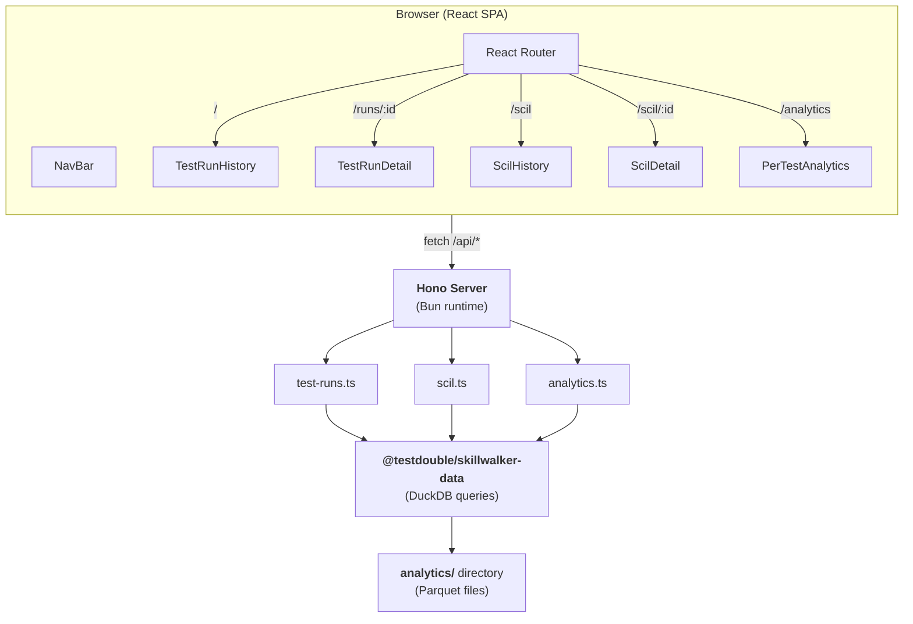
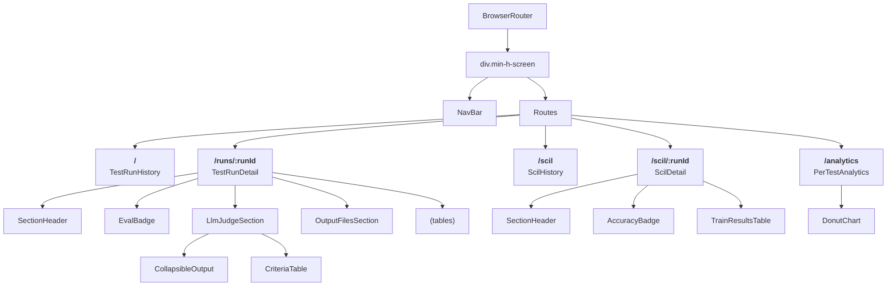

# Web Dashboard

> **Tier 5 · Contributor reference.** Internal documentation for the `packages/web` package. If you're a user looking to launch and use the dashboard, see [Viewing Results](getting-started/viewing-results.md).

Change this package when you need to touch the dashboard's Hono API server, the React SPA, the route handlers, or the page components. It provides a Hono-based API server and React SPA for viewing test run results, SCIL iteration history, and per-test analytics.

- **Last Updated:** 2026-05-15
- **Authors:**
  - River Bailey (river.bailey@testdouble.com)

## Overview

- Full-stack package with a Hono API server (Bun runtime) and a React 19 + Tailwind v4 SPA client, built with Vite 8
- Server delegates all data queries to `@testdouble/skillwalker-data` — route handlers are thin wrappers that forward a `dataDir` path and return JSON
- Client uses React Router v7 for SPA navigation across five pages: Test Run History, Test Run Detail, SCIL History, SCIL Detail, and Per-Test Analytics
- Compiled as a standalone Bun executable (`skillwalker-web`) with embedded client assets via Bun's `{ type: 'file' }` imports

Key files:
- `packages/web/src/server/index.ts` — Server entry point, CLI arg parsing, route registration, embedded asset serving
- `packages/web/src/client/index.tsx` — Client entry point, router and page registration
- `packages/web/src/server/routes/test-runs.ts` — Test run list and detail API endpoints
- `packages/web/src/server/routes/scil.ts` — SCIL history and detail API endpoints
- `packages/web/src/server/routes/analytics.ts` — Per-test analytics API endpoint

## Architecture



## Key Files

### Backend
| File | Purpose |
|------|---------|
| `packages/web/src/server/index.ts` | Server entry point — Yargs CLI, Hono app, route registration, embedded static asset serving, SPA fallback |
| `packages/web/src/server/routes/test-runs.ts` | `getTestRuns` and `getTestRunById` handlers delegating to `queryTestRunSummaries` / `queryTestRunDetails` |
| `packages/web/src/server/routes/scil.ts` | `getScilHistory` and `getScilRunById` handlers delegating to `queryScilHistory` / `queryScilRunDetails` |
| `packages/web/src/server/routes/analytics.ts` | `getPerTestAnalytics` handler with optional `?eval=` query param filter |

### Frontend
| File | Purpose |
|------|---------|
| `packages/web/src/client/index.tsx` | React entry point — BrowserRouter, route definitions, global layout |
| `packages/web/src/client/index.css` | Tailwind import and markdown content styling (`.markdown-content` class) |
| `packages/web/src/client/components/NavBar.tsx` | Top navigation bar with active-link indicators for History, SCIL History, Analytics |
| `packages/web/src/client/pages/TestRunHistory.tsx` | Test run list with aggregate stats (total runs, total tests, avg pass rate) and pass-rate progress bars |
| `packages/web/src/client/pages/TestRunDetail.tsx` | Single run detail — test summary table, expectation results, LLM judge results with collapsible criteria and markdown output |
| `packages/web/src/client/pages/ScilHistory.tsx` | SCIL run list with aggregate stats (total runs, unique skills, avg best accuracy) |
| `packages/web/src/client/pages/ScilDetail.tsx` | Single SCIL run detail — original description, iteration-by-iteration train/test results, best description highlight |
| `packages/web/src/client/pages/PerTestAnalytics.tsx` | Cross-run analytics — donut chart, eval breakdown, cost-by-test bars, expectation type summary |

### Infrastructure
| File | Purpose |
|------|---------|
| `packages/web/package.json` | Package config — `bin.skillwalker-web` points to server entry, workspace dependency on `@testdouble/skillwalker-data` |
| `packages/web/vite.config.ts` | Vite build config — Tailwind v4 plugin, React plugin, deterministic output filenames in `dist/client/` |
| `packages/web/tsconfig.json` | TypeScript config — ESNext target, bundler module resolution, `bun-types`, React JSX |
| `packages/web/index.html` | HTML shell — Inter font preconnect, `#root` mount point, module script entry |

## Core Types

### Backend

The server route handlers use Hono's `Context` type and delegate to `@testdouble/skillwalker-data` query functions. The route modules themselves define no custom types — all data shapes are defined in the `skillwalker-data` package.

### Frontend

```typescript
// packages/web/src/client/pages/TestRunHistory.tsx
interface TestRunSummary {
  test_run_id: string
  eval:       string
  date:        string
  total_tests: number
  passed:      number
  failed:      number
}

// packages/web/src/client/pages/TestRunDetail.tsx
interface TestRunDetailRow {
  test_run_id:             string
  test_name:               string
  eval:                   string
  is_error:                boolean
  all_expectations_passed: boolean
  total_cost_usd:          number
  num_turns:               number
  input_tokens:            number
  output_tokens:           number
}

interface TestRunExpectationRow {
  test_run_id:  string
  eval:        string
  test_name:    string
  expect_type:  string
  expect_value: string
  passed:       boolean
}

interface LlmJudgeCriterion {
  criterion:   string
  passed:      boolean
  confidence?: "partial" | "full"
  reasoning?:  string
}

interface LlmJudgeGroup {
  testName:    string
  rubricFile:  string
  model:       string
  threshold:   number
  score:       number
  passed:      boolean
  resultText?: string
  criteria:    LlmJudgeCriterion[]
}

interface OutputFileRow {
  testName:    string
  filePath:    string
  fileContent: string
}

// packages/web/src/client/pages/ScilHistory.tsx
interface ScilHistoryRow {
  test_run_id:         string
  skill_file:          string
  iteration_count:     number
  best_train_accuracy: number
}

// packages/web/src/client/pages/ScilDetail.tsx
interface ScilTrainResult {
  testName:  string
  skillFile: string
  expected:  boolean
  actual:    boolean
  passed:    boolean
  runIndex:  number
}

interface ScilIterationRow {
  test_run_id:   string
  iteration:     number
  phase:         string | null
  skill_file:    string
  description:   string
  trainResults:  ScilTrainResult[]
  testResults:   ScilTrainResult[]
  trainAccuracy: number
  testAccuracy:  number | null
}

interface ScilSummaryRow {
  test_run_id:         string
  originalDescription: string
  bestIteration:       number
  bestDescription:     string
}
```

## Constants

| Constant | Value | Description |
|----------|-------|-------------|
| `DEFAULT_PORT` | `3099` | Default port for the Hono server when `--port` is not specified |
| Default `data-dir` | `process.cwd()/analytics` | Default analytics data directory resolved from the current working directory |

## Implementation Details

### Backend

#### Server Startup and Asset Embedding

The server entry (`packages/web/src/server/index.ts`) uses Yargs to parse `--port` and `--data-dir` CLI arguments. It registers the API routes, a `jsonErrorHandler` via `app.onError` so unexpected errors reach the client as JSON, and the static asset routes. The client build output (`dist/client/`) is embedded using Bun's `import ... with { type: 'file' }` syntax, which resolves to `$bunfs` paths in compiled standalone executables. A SPA fallback (`/*`) serves `index.html` for all unmatched paths, enabling client-side routing.

#### Route Handler Pattern

All three route modules follow the same pattern: receive a Hono `Context` and a `dataDir` string, call the corresponding `@testdouble/skillwalker-data` query function, and return the result via `c.json()`. Error handling distinguishes "not found" and `InvalidRunIdError` errors (returned as 404 JSON) from unexpected errors (re-thrown to `jsonErrorHandler`). Missing Parquet files need no route-level handling: the data layer returns empty results or throws "run not found".

```typescript
// packages/web/src/server/routes/test-runs.ts — typical handler pattern
export async function getTestRunById(c: Context, dataDir: string): Promise<Response> {
  const runId = c.req.param('runId') ?? ''
  try {
    const { summary, expectations, llmJudgeGroups, outputFiles } = await queryTestRunDetails(dataDir, runId)
    return c.json({ summary, expectations, llmJudgeGroups, outputFiles })
  } catch (err) {
    if (err instanceof InvalidRunIdError || (err instanceof Error && err.message.startsWith('Test run not found:'))) {
      return c.json({ error: 'Not found' }, 404)
    }
    throw err
  }
}
```

#### Analytics Filtering

The `/api/analytics/per-test` endpoint supports an optional `?eval=` query parameter. When provided, rows are filtered client-side after the full query completes. When absent, all rows are returned.

### Frontend

#### Page Components and Data Fetching

Each page component follows a consistent pattern: `useState` for data, error, and loading states; a `useEffect` that fetches from the corresponding `/api/*` endpoint on mount; and three conditional renders for loading, error, and data states. No custom hooks or global state management — each page is self-contained.

#### Test Run Detail Page

The most complex page, `TestRunDetail`, renders three sections:

1. **Test Summary** — table of per-test results with cost, turns, and token usage
2. **Expectation Results** — table of individual expectation assertions with type badges (`has_call`, `not_call`, `no_mention`)
3. **LLM Judge Results** — rendered only when `llmJudgeGroups` is present; each group shows rubric metadata, a collapsible full-output panel (rendered as markdown via `marked`), and an expandable criteria table with per-criterion reasoning
4. **Output Files** — rendered only when `outputFiles` is present and non-empty; shows files written by the skill/agent during execution, grouped by test name, with file path and content displayed in a collapsible panel

#### SCIL Detail Page

Displays a single SCIL improvement loop run with:

1. **Original Description** — the starting skill description
2. **Iterations** — each iteration shows the rewritten description, train/test accuracy badges, and a train results table showing expected vs actual trigger behavior
3. **Best Description** — highlighted with a green border, showing which iteration produced the highest train accuracy

#### Per-Test Analytics Page

Aggregates data across all test runs with:

- **Summary stats** — total runs, total tests, pass rate, total cost, average turns
- **Donut chart** — CSS conic-gradient pass/fail visualization (no charting library)
- **Eval breakdown** — per-eval runs, tests, and pass rate with progress bars
- **Cost by test** — horizontal bar chart of top 3 most expensive tests
- **Expectation types** — static list of known expectation types

## API Endpoints

| Method | Path | Handler | Description |
|--------|------|---------|-------------|
| `GET` | `/api/health` | inline | Returns `{ status: 'ok' }` |
| `GET` | `/api/test-runs` | `getTestRuns` | List all test run summaries |
| `GET` | `/api/test-runs/:runId` | `getTestRunById` | Get test run detail (summary, expectations, LLM judge groups, output files) |
| `GET` | `/api/analytics/per-test` | `getPerTestAnalytics` | Get per-test analytics rows, optional `?eval=` filter |
| `GET` | `/api/scil` | `getScilHistory` | List all SCIL run summaries |
| `GET` | `/api/scil/:runId` | `getScilRunById` | Get SCIL run detail (summary, iterations) |

### GET /api/test-runs

**Response:**
```json
{
  "runs": [
    {
      "test_run_id": "20240103T120000",
      "eval": "eval-a",
      "date": "2024-01-03T12:00:00.000Z",
      "total_tests": 2,
      "passed": 1,
      "failed": 1
    }
  ]
}
```

### GET /api/test-runs/:runId

**Response (200):**
```json
{
  "summary": [{ "test_run_id": "...", "test_name": "...", "eval": "...", "is_error": false, "all_expectations_passed": true, "total_cost_usd": 0.05, "num_turns": 3, "input_tokens": 1200, "output_tokens": 800 }],
  "expectations": [{ "test_run_id": "...", "eval": "...", "test_name": "...", "expect_type": "has_call", "expect_value": "Skill(foo)", "passed": true }],
  "llmJudgeGroups": [{ "testName": "...", "rubricFile": "...", "model": "...", "threshold": 0.8, "score": 0.9, "passed": true, "criteria": [] }],
  "outputFiles": [{ "testName": "...", "filePath": "docs/analysis.md", "fileContent": "..." }]
}
```

**Response (404):**
```json
{ "error": "Not found" }
```

### GET /api/scil/:runId

**Response (200):**
```json
{
  "summary": { "test_run_id": "...", "originalDescription": "...", "bestIteration": 2, "bestDescription": "..." },
  "iterations": [{ "test_run_id": "...", "iteration": 1, "skill_file": "...", "description": "...", "trainResults": [], "testResults": [], "trainAccuracy": 0.85, "testAccuracy": null }]
}
```

**Response (404):**
```json
{ "error": "Not found" }
```

## Frontend Components

### Component Hierarchy



### Routing

| Route | Page Component | Description |
|-------|----------------|-------------|
| `/` | `TestRunHistory` | Main listing of all test runs with aggregate stats |
| `/runs/:runId` | `TestRunDetail` | Detail view for a single test run |
| `/scil` | `ScilHistory` | Listing of all SCIL improvement loop runs |
| `/scil/:runId` | `ScilDetail` | Detail view for a single SCIL run's iterations |
| `/analytics` | `PerTestAnalytics` | Cross-run aggregate analytics dashboard |

## Error Handling

### Backend
| Scenario | Error / HTTP Status | Behavior |
|----------|---------------------|----------|
| Test run not found | `404` `{ error: "Not found" }` | Error message starts with `"Test run not found:"` |
| SCIL run not found | `404` `{ error: "Not found" }` | Error message starts with `"SCIL run not found:"` |
| ACIL run not found | `404` `{ error: "Not found" }` | Error message starts with `"ACIL run not found:"` |
| Malformed run ID | `404` `{ error: "Not found" }` | Detail routes catch `InvalidRunIdError` from the data layer |
| No data (missing or empty data directory, or missing Parquet files) | `200` `{ runs: [] }` / `{ rows: [] }` for lists; `404` for details | The data layer returns empty results or throws "run not found"; routes do no file checks of their own |
| Unexpected error | `500` `{ error: "Internal server error" }` | Non-matching errors are re-thrown to `jsonErrorHandler` (registered with `app.onError`), which logs them and returns JSON |
| Non-Error throwable | `500` JSON | String or other non-Error values bypass the `instanceof Error` checks and reach `jsonErrorHandler` |

### Frontend
| Scenario | Error Handling | Behavior |
|----------|----------------|----------|
| API fetch failure | Error state string | Every page fetches through `fetchJson()` (`client/lib/fetch-json.ts`), which throws the server's `error` field for a non-OK response, or the status text when the body is not JSON. The message is displayed in a red-bordered error banner |
| Empty data | Empty state message | Displayed as centered gray text with usage instructions on the History, SCIL History, ACIL History, and Analytics pages |
| Loading | Loading state | Displays centered "Loading..." text |

## Configuration

| Variable | Description | Default |
|----------|-------------|---------|
| `--port` | Port for the Hono HTTP server | `3099` |
| `--data-dir` | Path to the analytics data directory containing Parquet files | `${cwd}/analytics` |

## Testing

### Backend
- `packages/web/src/server/routes/test-runs.test.ts` — Tests `getTestRuns` and `getTestRunById` with mocked `skillwalker-data` query functions
- `packages/web/src/server/routes/scil.test.ts` / `acil.test.ts` — Test the SCIL and ACIL history and detail handlers, including 404 for malformed run IDs
- `packages/web/src/server/routes/error-handler.test.ts` — Tests that `jsonErrorHandler` logs the error and returns a JSON 500
- `packages/web/src/server/routes/analytics.test.ts` — Tests `getPerTestAnalytics` including eval filter behavior

### Frontend
- `packages/web/src/client/lib/fetch-json.test.ts` — Tests `fetchJson` with OK, non-OK JSON, and non-OK plain-text responses, using `vi.stubGlobal('fetch', ...)`

### Test Patterns
- All tests mock `@testdouble/skillwalker-data` at the module level using `vi.mock()` with inline factory functions
- A `makeMockContext()` factory creates mock Hono `Context` objects with configurable `param` and `query` accessors
- Tests verify both the happy path (data returned) and error paths (not found, unexpected errors, non-Error throwables)
- `beforeEach` clears all mocks between tests via `vi.clearAllMocks()`

## Related References

- [Skillwalker Architecture](./skillwalker-architecture.md) — System architecture, package boundaries, data flow, and dependency graph for the full Skillwalker monorepo
- [Parquet Schema](./parquet-schema.md) — Schema definitions for the analytics Parquet files queried by the data layer
- [LLM Judge](./llm-judge.md) — LLM judge evaluation system whose results are displayed in the Test Run Detail page
- [Data Package](./data.md) — Shared data layer: types, DuckDB queries, and analytics functions consumed by the web server
- [Sandbox Integration](./sandbox-integration.md) — Test Sandbox architecture that produces the test run data this dashboard displays
- [CLI Package](./cli.md) — CLI commands that produce the test run and analytics data this dashboard displays

---

**Next:** [Data Package](./data.md) — the DuckDB query functions every route handler in this package delegates to.
**Related:** [Viewing Results](./getting-started/viewing-results.md) — the user-facing guide to launching and navigating this dashboard.
